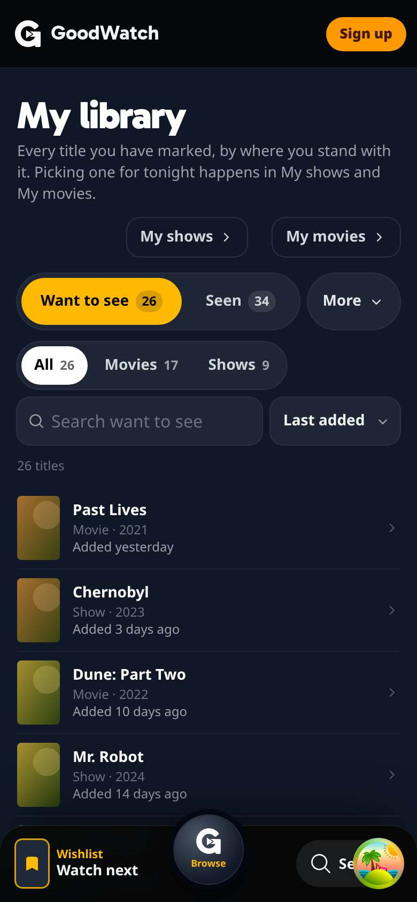
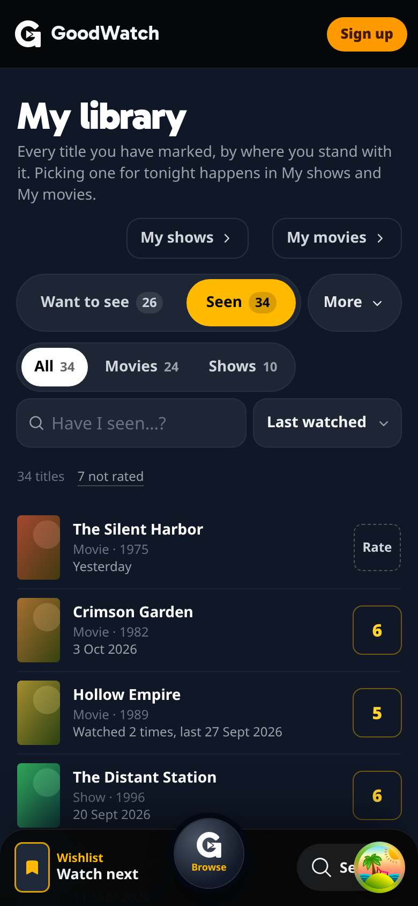
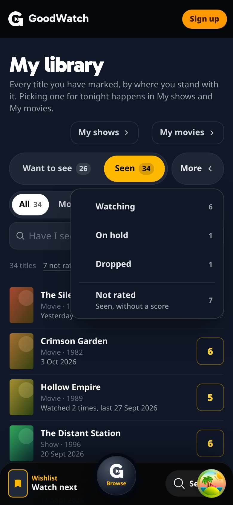
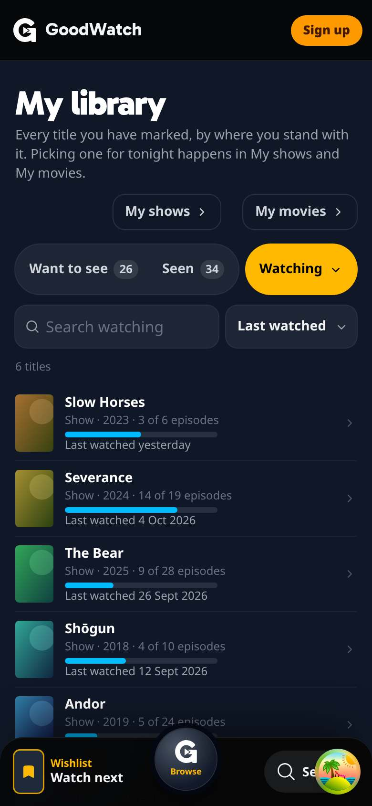
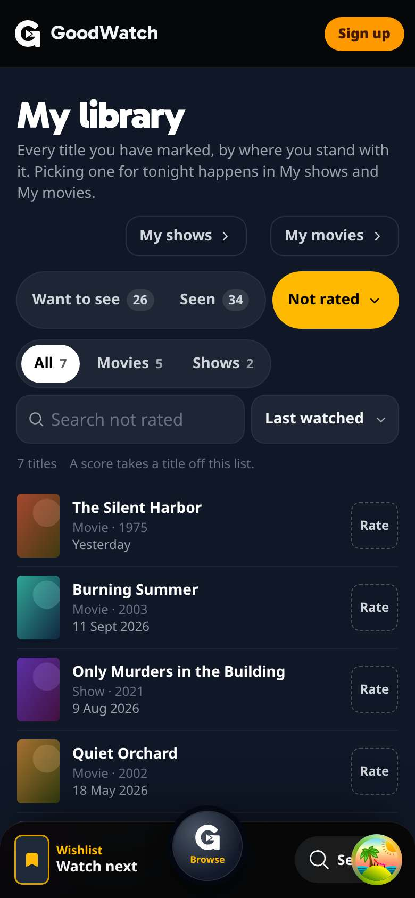
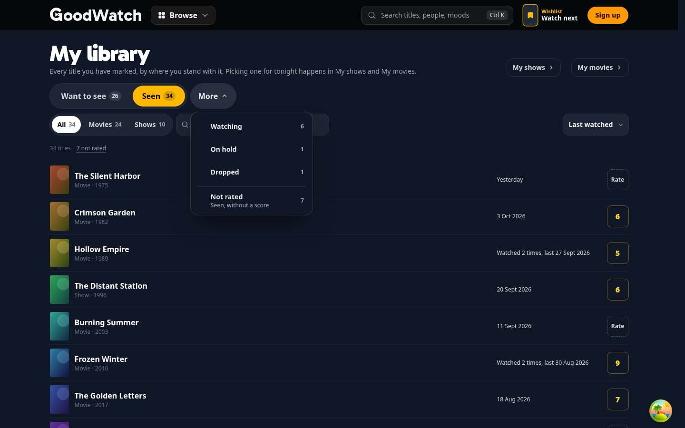

# Home doors, My shows, My movies and My library

What [#385](https://github.com/alp82/goodwatch-monorepo/issues/385) built, from the decisions of
[#371](https://github.com/alp82/goodwatch-monorepo/issues/371). Everything is behind `REC_TRACKING`, the flag of the
movie watch log and of episode tracking. Vocabulary: [`CONTEXT.md`](../../../../CONTEXT.md). Reads:
[data-model.md](../data-model.md), section 4. Paths without a prefix are under `goodwatch-webapp/app/`.

## My library: the arrangement that had no prototype

The owner's sentence after round 3 was "use the library but everything except the main 2 in a drop-down". Built from
round 3's library variant plus that sentence:

- **Two choices are always shown**: a two-way switch, Want to see and Seen, each with its count. Want to see is the
  page's first view.
- **Four are in a drop-down** beside the switch: Watching, On hold, Dropped and, under a rule, Not rated, each with
  its count. The button reads "More" while one of the two main choices is on.
- **While one of the four is chosen**, the drop-down's button is lit and carries its name, and neither half of the
  switch is lit. On a wide screen the button also carries the count; on a phone the count is in the line under the
  controls ("6 titles"), so the row stays one line at 390 pixels.
- Under the status row: a movies/shows filter with counts (not for the three show statuses), a search over the list,
  and a sort. Sorts: Last watched, My score and Title on Seen; Last watched and Title on the four in the drop-down;
  Last added and Title on Want to see.
- Rows, not posters, as in round 3's library: poster, title, kind and year, and the fact the order goes by. A Seen
  row ends in the member's score or a Rate key; either opens a bar of ten keys. A row opens the title's page.
- A list is drawn in steps of 60 ("Show 60 more · 1,444 left").
- The choice is in the URL: `/my-library?status=seen&sort=score&type=movie&q=alien`, defaults left out.








More: [the rating bar](library-rate-bar-phone.jpg), [1,500 Seen titles](library-seen-1500-phone.jpg),
[nothing marked](library-empty-phone.jpg); desktop [Want to see](library-want-desktop.jpg),
[Seen](library-seen-desktop.jpg), [Watching](library-watching-desktop.jpg),
[Not rated](library-not-rated-desktop.jpg), [1,500](library-seen-1500-desktop.jpg).

**What the sentence left open, and what was chosen:**

| Open | Chosen | Why |
| --- | --- | --- |
| What the drop-down's button says | "More", and the chosen status's name while one of the four is on | The page then always shows which list is on screen |
| Whether Not rated is a status | It is in the drop-down under a rule, with the line "Seen, without a score" | It is a view of Seen, and the owner listed it with the three statuses |
| The "quiet route to unrated Seen titles" | The drop-down's entry, and on Seen a small text link "7 not rated" under the controls | The entry alone is two taps and not visible from Seen. The link is one line of small type and is easy to take out |
| Which is first | Want to see | `/wishlist` lands here, and the Wishlist was the page this one grew from |
| Where a rated show without a state goes | Seen | It counts as Seen everywhere else. A rated show that is Watching stays under Watching: a title is in one of the four states only |
| What a Seen show says | Its last watch's day, not "Watched 8 times": a show's log rows are episodes | |
| Want to see's sorts | Last added and Title | The ticket names the Seen sorts; Best match and the moods are My movies' and My shows' |

## Routes, and what replaces what

| Route | Flag off | Flag on, member | Flag on, guest |
| --- | --- | --- | --- |
| `/` | Today's home | Three doors in place of the two tiles | Today's home |
| `/my-shows` | 404 | My shows | The page's name and a sign-up card |
| `/my-library` | 404 | My library | The page's name and a sign-up card |
| `/my-movies` | 302 to `/watch-next` | My movies (needs `REC_WATCH_NEXT` too) | 302 to `/watch-next` |
| `/watch-next` | Watch next | 302 to `/my-movies`, with the sort, moods and services choice | Watch next |
| `/wishlist` | As today: 301 to `/watch-next`, or the old page while `REC_WATCH_NEXT` is off | 302 to `/my-library` | As today |
| `/api/my-library` | 404 | One step of a list | 401 |
| `/api/watch-next?kind=movie&time=120` | `kind` and `time` are ignored | My movies' data | `kind` and `time` are ignored |
| `/api/tonight` | As today | The pick may be an episode | As today |

`preview` shows all of it to the members in `REC_PREVIEW_USERS` only. The names follow `/watch-next`: `/shows` and
`/movies` are the catalog pages. The redirects are `private, no-store` and vary by cookie, so a flag can switch back.

With the flag on for a member:

- **Watch next, the page, is My movies.** The Wishlist's shows to start are in My shows. A guest keeps Watch next,
  which still shows movies and shows together.
- **The Wishlist, the page, is My library's first choice.**
- **The hub** (phone sheet and Browse panel) shows My shows, My movies and My library in place of the Watch next
  tile; its account row's "Wishlist" leads to My library. The Living room's remote and menu still say Watch next
  and lead there, which redirects.
- **Tonight's pick** in the dock and the header links to the page it is the first thing on, and says "Tonight ·
  S1 E4" when it is an episode.

## What each page is

**Home** (`ui/living-room/HomeDoors.tsx`, a chunk of its own): Continue, Start a show, A movie. Continue opens My
shows, Start a show opens `/my-shows#start`, A movie opens My movies. A door with nothing behind it is not drawn and
Something new takes a tile; with all three doors Something new is a key in the head line (desktop) or under the
doors (phone). No row was added. The doors arrive with the home's loader data (`doors`), and are drawn once the page
has hydrated.

**My shows** (`ui/my-shows/MyShowsPage.tsx`, `server/my-shows.server.ts`, `domain/my-shows.ts`): one list. Continue:
Watching shows with a Next episode and activity in the last 30 days, most recent first, then Seen shows with new
episodes. Start: Want to See shows not started, best taste match first, with seasons, episodes, hours and whether
it still runs. The rule is a sentence on the page and each group has a label. A row is one link to the show's page:
no Watched button, no tick. Under the list: Not watched for 30 days (closed), Waiting for episodes, On hold
(closed), Dropped (closed).

**My movies** (`routes/my-movies.tsx`, `ui/my-movies/parts.tsx`, and Watch next's page and server with
`kind: "movie"`): the Watch next page for the Wishlist's movies. Hero ("Tonight's movie · …"), Then, and the tiers
Up next, Soon and Later. "How long?" is the fourth choice: a select in the desktop strip, a fourth button and
drawer on a phone (Any length, Up to 1h 30, Up to 2h, Up to 2h 30; `time=120` in the URL). Everything that does not
fit tonight is one closed group, Not tonight's fit, where each movie says why: "35 min over", "Another mood" or
"Not on your services". Every word a member reads says "movie".

**Tonight's pick** (`server/tonight.server.ts`, `tonightsPickOf`): the Next episode of the Watching show the member
was last active on in the last 30 days; without one, the first movie of My movies; without one, the first show to
start; with none of them, what it is today.

## Reads

No page scans the watch log.

| Page | Reads |
| --- | --- |
| My shows | The member data (cached). One read of `show` by key for the tracked and wished shows (Q5, with the title, pictures, counts and `episode_runtime`). The cached episode list of each Continue row, at most 30. For a Continue row whose Next episode is in a gap, the show's log rows by key, all such shows in one statement |
| Home doors, Tonight's pick | The same, with one episode list, and Watch next's plan over the Wishlist's movies with three title cards |
| My library | The member data. The cards of one step by key (Q6). For the Title sort or a search, the titles of the status's keys by key, kept in memory for six hours |
| My movies | As Watch next. With a time chosen, the runtimes of the Wishlist's movies by key, kept in memory for six hours (`server/movie-runtimes.server.ts`): the title snapshot holds no runtime |

**The member data gained nothing.** `watchState` already carries `episodesWatched`, `furthest` and
`lastActivityAt`, which is everything the Continue rows need. The map's size is unchanged.

## How it was checked

Tests, from `goodwatch-webapp`:

```
node --test app/domain/my-shows.test.ts app/domain/my-library.test.ts app/domain/my-movies.test.ts \
  app/server/my-pages.test.ts app/ui/watch-next/labels.test.ts app/ui/living-room/tv-flow.test.ts
```

The rules are pure functions (groups and order of My shows, the Next episode, Tonight's pick's three fallbacks, the
library's counts, orders and steps, the time fit). `my-pages.test.ts` runs the server reads against the in-memory
Crate of the tracking tests and asserts which statements they send.

The pages were driven in headless Chromium at 390 x 844 and 1440 x 900 on `/prototype/my-library-real`, a
development route that a production build leaves out. It mounts the real pages with a member who does not exist.
Its loader and API run **the app's own server functions** against an in-memory Crate in the dev server
(`server/prototype-my-library.server.ts`), with round 3's sample members (6, 1 and 25 Watching shows, none, nothing
marked) and Seen histories of 30 and 1,500. A score given in the harness goes through the real `updateScores`.
173 checks, all passing, three runs in a row; the script is [`drive.mjs`](drive.mjs):

```
cd goodwatch-webapp        # no .env: the harness refuses to start when CRATE_HOSTS is set
REC_TRACKING=on REC_WATCH_NEXT=on REC_NAVIGATION=on REC_TASTE_MATCH=on \
  node_modules/.bin/remix vite:dev --port 3107 --strictPort --host 127.0.0.1
HARNESS=http://127.0.0.1:3107 node drive.mjs <screenshot dir>   # with playwright-core beside it, and system Chromium
```

`/prototype/my-library-real?page=library|shows|movies|home&member=six|one|many|none|empty&seen=30|1500|0`

The titles of the fixture are names only, and many are made up. Posters and backdrops are paths that lead nowhere:
the script paints a tile for each, so no request leaves for TMDB, and a person who opens the harness sees grey
boxes. The site's header and dock around the pages see a guest; the harness shows the member's Tonight's pick in
its own bar.

Screenshots, each `-phone` and `-desktop`: `library-want`, `library-seen`, `library-more-open`,
`library-watching`, `library-not-rated`, `library-rate-bar`, `library-seen-1500`, `library-empty`, `shows`,
`shows-start`, `shows-25`, `shows-none`, `movies`, `movies-time`, `movies-time-drawer` (phone), `home`,
`home-none`.

With `REC_TRACKING` unset the dev server answered 404 for `/my-shows`, `/my-library` and `/api/my-library`,
redirected `/my-movies` to `/watch-next`, and served `/watch-next` and `/wishlist` as on `main`.

**Not checked,** because each needs a signed-in session, the real tables or a real device: every statement against
a real Crate; the pages for a real member, with real posters, taste and services; the home's loader with the doors
and the real TV's Remote; the hub's tiles; the redirects for a member; a touch screen, Safari and Firefox, a screen
reader; `./bench.sh budget`.

## The first view

Client scripts of a route's first view (entry, root and route with their static imports), `npm run build` on this
branch and on `main` at `15db647d`, sizes as `scripts/precompress.mjs` writes them:

| Page | Files | Raw | Brotli | Of which |
| --- | --- | --- | --- | --- |
| Home | 15, as before | 824,814 to 828,090 (+3,276) | 231,891 to 232,913 (+1,022) | home's chunk +1,661 (the doors' focus items and lazy mount), `WatchNextHero` +1,003 (shared with Watch next: the movie words), `shell` +612 (the three destinations, the pick's link) |
| Show page | 20, as before | 815,983 to 816,594 (+611) | 232,571 to 232,709 (+138) | `shell` |
| Watch next | 24 to 25 | 991,641 to 995,873 (+4,232) | 284,149 to 285,684 (+1,535) | the page became a chunk My movies shares |

The same holds with the flag off: the bytes are in the files either way. Loaded only by a member whose home has
doors: `HomeDoors` 3,631 bytes (1,516 Brotli). The new pages: My library 587,859 (166,627), My shows 575,718
(163,192), My movies 999,864 (287,314); the rating bar loads at the first press, 2,254 (998).

`./bench.sh budget` needs a deployed site and was not run. To check there: `script_bytes` and `script_count` of home
and of the title page against `goodwatch-benchmark/urls/budget.json`. No script file was added to a landing
surface's first view; home grows by about 1 KB compressed.

## Where the build differs from the decision

- **Home's Continue door has no Watched key.** Round 3's home kept one on the tile. Marking an episode from home
  would bring the tracking writer, its toast and its Undo into the home's first view; the door opens My shows, and
  the episode is marked on the show's page.
- **The doors are drawn after hydration, not by the server.** A lazy part in the server's markup is hydrated after
  the rest, and the TV's first state changes in between made React drop it (error 421) on every load. Until the
  doors' code is there, the home shows its head line alone.
- **Tonight's pick is never a Seen show with new episodes.** Such a show leads Continue when no Watching show was
  active in the last 30 days, and the pick is then the first movie, as the glossary says.
- **A Watching show with every aired episode watched** waits for episodes, like a caught-up Seen show. The machine
  makes such a show Seen, so this only happens when the catalog lost an episode.
- **A show the catalog has no aired count for** stays in Continue or in the older group by its activity, without a
  Next episode line, until the episode catalog reaches it.
- **My movies keeps one group for what does not fit.** Watch next has three (Other moods or Elsewhere, Close, Not
  tonight). My movies has one, closed, as the prototype had.
- **My movies needs `REC_WATCH_NEXT`.** It is Watch next's page and endpoints.
- **Moods on My movies** are Watch next's real moods, not the prototype's made-up ones.
- **A Seen row has no "Imported from …" line.** The member data does not say where a watch came from, and the
  library reads no log.
- **A score given in the library** shows on its row at once. A list read before the score shows its old count for a
  moment and then follows.
