# A page for shows and a page for films

Round 2 of the prototype for [#371](https://github.com/alp82/goodwatch-monorepo/issues/371), part of the map
[#365](https://github.com/alp82/goodwatch-monorepo/issues/365). Throwaway code on the branch `prototype/watching-2`.
Round 1 is untouched at `/prototype/watching` ([notes](../watching/README.md)).

## The question

The owner tried round 1 and said:

> A's extra row is too much for the home screen. the combined wishlist pages do not work for me. i think i want to
> explore further how it would look if we would have some paths towards separate movie and show pages, then they could
> be optimized for that specific task. usually a user knows if they want to continue or start a new show, or if they
> want a movie next.

So a person arrives with one of three intents: continue a show, start a show, or watch a film. This round gives each
its own place and asks four things:

1. How does the living room offer the paths without an extra row?
2. What does a page for shows look like when it serves both continue and start?
3. What does a page for films look like when it is built for picking one tonight?
4. What becomes of the Wishlist, as a page and as a word?

## How to open it

```
git switch prototype/watching-2
cd goodwatch-webapp
REC_NAVIGATION=on REC_WATCH_NEXT=on npm run dev
```

Then open `http://localhost:3003/prototype/watching-2`. The loader reads TMDB with `TMDB_API_KEY` from the usual
`.env`. The route answers 404 in production.

Each of the four pieces has its own parameter, so any combination can be looked at:

| Parameter | Values | Meaning |
|---|---|---|
| `surface` | `home`, `shows`, `films`, `wishlist` | Which piece is on screen. |
| `home` | `doors`, `rail`, `nav` | Home variants A to C. |
| `shows` | `lead`, `switch`, `ranked` | My shows variants A to C. |
| `films` | `hero`, `time`, `compare` | My films variants A to C. |
| `wishlist` | `behind`, `dissolved` | Whether the Wishlist stays a page. It also changes the links on the other pages. |
| `member` | `six`, `one`, `many`, `none` | A sample member with 6, 1 or 25 Watching shows, or one who tracks nothing. |
| `mode` | `continue`, `start` | Shows variant B only: which side of its switch shows. |
| `chrome` | `off` | Hides the prototype's own controls. |

The white controls with the fuchsia ring are the prototype's own: the four surfaces, the sample member, **State** (the
picks and every tracked show after each action), **Reset**, **Hide**, and the pill that switches the variant of the
surface on screen (the left and right arrow keys do the same). Everything else is the design, including the site
header, the phone dock and the Browse panel, which are drawn over the real ones because the paths live in them.

The pieces are wired together: a tile on home opens the page, the pages link to each other and to the Wishlist, and
what you mark stays marked while you move around. Things to try:

- On home, turn the Remote's wheel and press OK. In variant C, press the Remote's Shows and Films keys.
- **Watched** on any Next episode: the card moves on to the following episode and a toast offers Undo.
- **Watched** on The Last of Us, whose newest episode aired today: it becomes caught up and moves to "Waiting for
  episodes".
- **Watched S1 E1** on a show to start: it leaves the start list and appears among the Next episodes.
- Open "Not watched for 30 days" and tap Watched twice on Shōgun: it is watched through, becomes Seen, and the one
  prompt to rate appears.
- In My films, pick a mood, switch to Everywhere, change the sort, tap **Not tonight** and **I watched it**. In
  variant B, change the time.

## What is real and what is made up

- Posters, backdrops, episode names, runtimes, seasons, episode counts, whether a show has ended, and the first US
  subscription service come from TMDB through the loader. The key stays on the server.
- Made up: what each sample member watched and when, taste match numbers, when a title was added, and the member's
  services (Netflix, HBO Max, Apple TV, Disney+, Hulu, Prime Video, YouTube TV). Moods are derived from TMDB's genres,
  not from fingerprints. Where TMDB lists no US subscription for a film, a service is made up, except for two films
  that stay without one. A show's total time is its episode count times TMDB's episode runtime.
- Round 1's model, store, kit and fixture are reused unchanged. This round adds five shows and six shorter films to
  the sample Wishlist, because round 1's films all ran over two hours.
- Every action stays in React state. A reload starts over. Nothing is read from or written to a database or cache, and
  no mutation endpoint is called.
- The home is the real room photo, TV geometry, canvas scale and Remote from `ui/living-room`. The Remote's wheel and
  OK work; its other keys do nothing. The moods, On my services and sort controls on My films work in the browser but
  are drawn for this prototype, not the shipped components.

## 1. The paths from home

No variant adds a row. The TV keeps its head and one band under it.

### A · Three doors (`home=doors`)

The two tiles become the three intents: **Continue** (the Next episode, with a Watched key on the tile), **Start a
show** and **A film**. Something new becomes a text key in the head line; with nothing to continue it is the third
tile again.

- Strongest: the screen asks "What are we watching?" and the three answers are the owner's three intents, each one
  press from its page.
- Weakest: three tiles are narrower than two, and on the phone TV Something new no longer fits on the screen and is
  only in the menu.

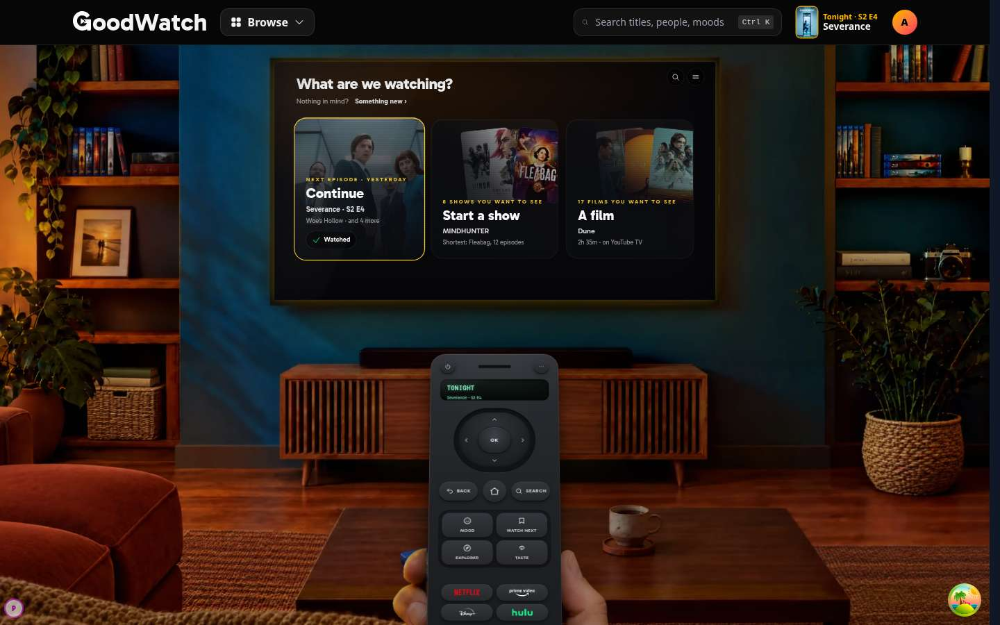
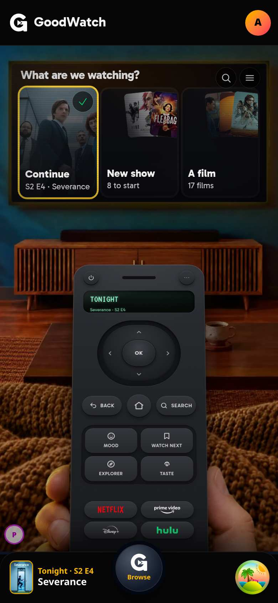

### B · One pick, three intents (`home=rail`)

A list of the intents on the left (on the phone, a row of three) and one large pick beside it that changes with the
focused intent: the Next episode, the best show to start with what it costs, or tonight's film. OK opens the page.

- Strongest: home already answers the question for each intent, with room for the facts a tile can't hold (episode
  name, seasons and hours, runtime and service).
- Weakest: reaching a page takes a focus and a press, and Tonight's pick turns into three picks, which the single
  thumb in the header can't show.

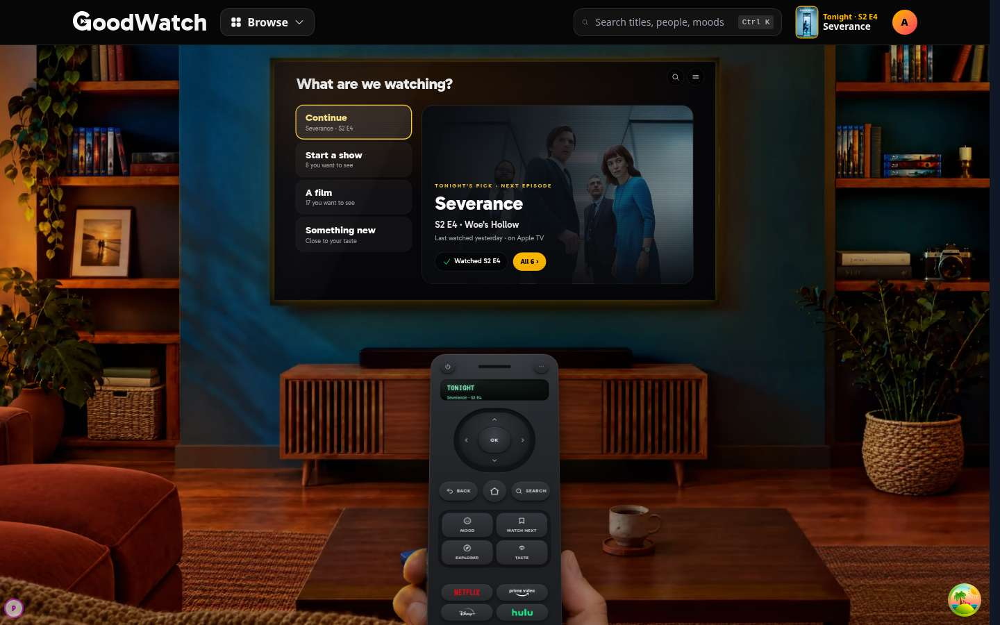
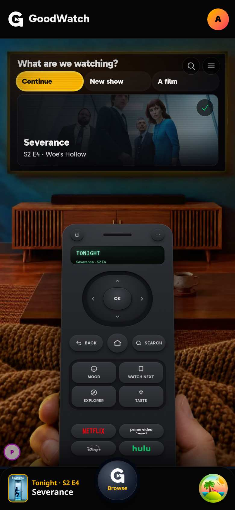

### C · Home as shipped, paths in the navigation (`home=nav`)

The TV is today's screen: Watch next and Something new. The paths are around it: Tonight's pick in the header and the
dock becomes a pair (the Next episode and the film), the Remote's Watch next key splits into Shows and Films, and the
Browse panel leads with My shows and My films.

- Strongest: nothing on the TV changes, and the pair is one tap away on every page, not only on home.
- Weakest: the living room itself still offers neither a show nor a film, and its Watch next tile needs the Wishlist
  to stay a page to have somewhere to go.

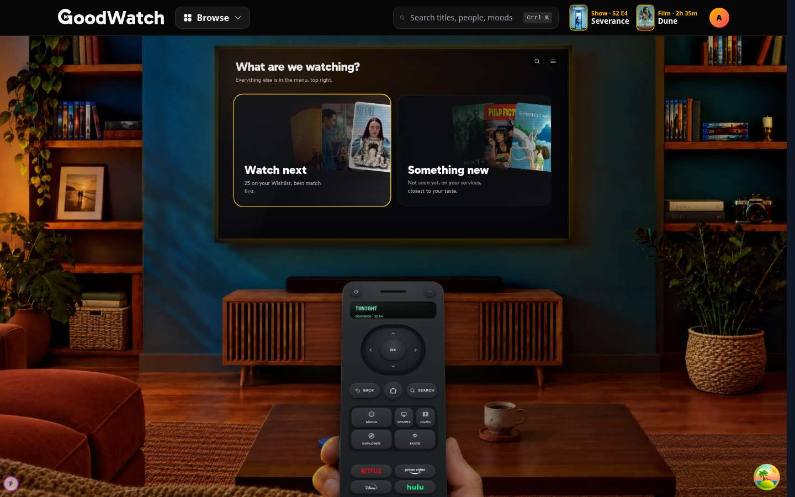
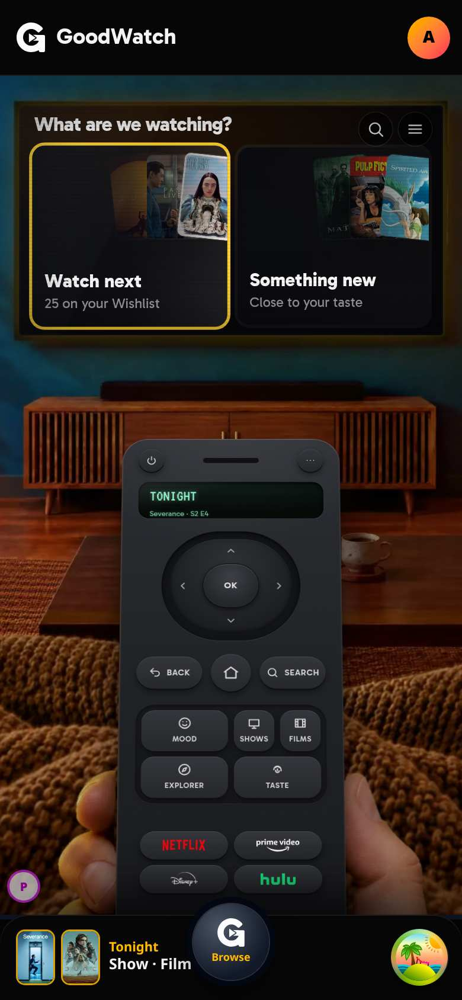

In A and B the header and the dock keep one Tonight's pick, as round 1 recommended it: the Next episode of the show
watched most recently in the last 30 days, else the first film. In all three the Browse panel has My shows and My
films where Watch next was ([screenshot](browse-behind-desktop.jpg)).

## 2. My shows

Every variant shows the Next episode with season, episode, name, air date and time since the last watch, one-tap
Watched with Undo, Seen shows with new episodes, and the shows to start with seasons, episodes, total hours, whether
the show has ended, where it streams and its taste match. All three end with the same quiet groups: "Not watched for
30 days" (closed), "Waiting for episodes" (caught up, or a season that starts on a date), and "On hold" (closed).

### A · Continue leads (`shows=lead`)

The Next episode of the show watched most recently is the hero, with the next three beside it and the rest as cards.
"Start a show" follows as a section of cards. A member who is in the middle of nothing gets the best show to start as
the hero.

- Strongest: one page answers both intents without a choice to make first, and what is most likely tonight is the
  largest thing on it.
- Weakest: someone who came to start a show scrolls past the hero and the cards to get there, further with 25 shows.

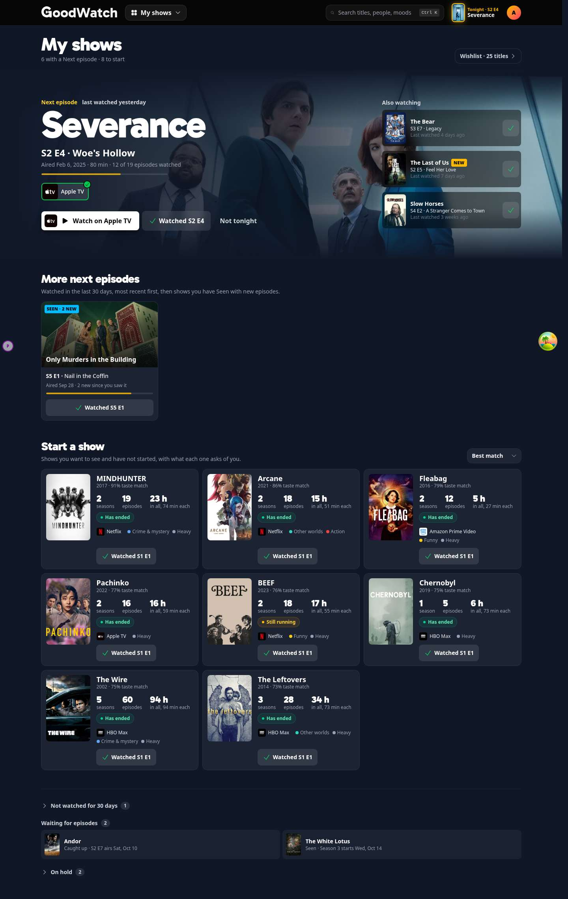

### B · Continue | Start (`shows=switch`)

A switch at the top. Continue is a plain list of rows with progress and an On hold key. Start is a hero for the best
show to start and a table that puts what each show asks side by side.

- Strongest: each side is built for its task; the list holds 25 shows calmly, and the table is the clearest view of
  what starting costs.
- Weakest: the page asks the question again that home may already have asked, and one side is always hidden.

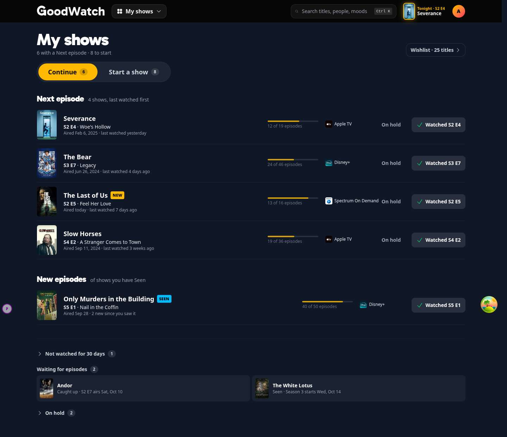
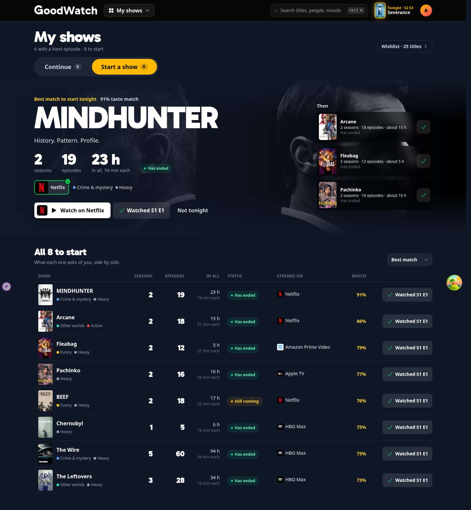

### C · One list for tonight (`shows=ranked`)

One numbered list: the shows watched most recently first, and after every third a show to start. Each row has a tag:
Next episode, New episodes, or Start.

- Strongest: it is the shortest page and reads top to bottom as "what could I watch tonight".
- Weakest: the order needs a rule nobody can guess (why is a show to start at place 4?), and the facts of a Next
  episode and of a show to start don't line up in one row shape.

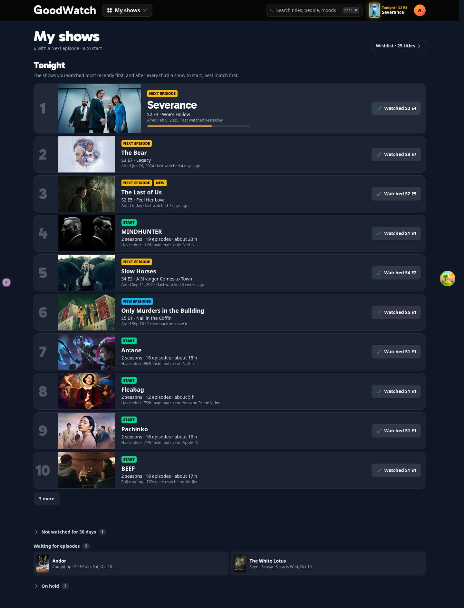

With 25 Watching shows: [A](shows-lead-25-desktop.jpg), [B](shows-switch-25-desktop.jpg),
[C](shows-ranked-25-desktop.jpg). In all three only the shows watched in the last 30 days lead (8 of the 25); the
other 17 are in the closed group. With none: [A](shows-lead-none-desktop.jpg), [B](shows-switch-none-desktop.jpg).

## 3. My films

Only Want to See films. A film the person has seen is not here: "I watched it" takes it off. Each variant has
Tonight's pick for films, runtime, service, taste match and mood on every film, and the moods, On my services and
sort.

### A · Hero and tiers (`films=hero`)

Today's Watch next page, for films: the docked strip with moods, On my services and the sort, the hero with Then, and
the grid. Runtime moves up beside the title, and every card says how long, where, and how well it matches.

- Strongest: it is the shipped page with films only, so the controls sit exactly where they are today and little is
  new to build.
- Weakest: it treats a film like any title; runtime is a fact on a card, not something the page helps decide with.

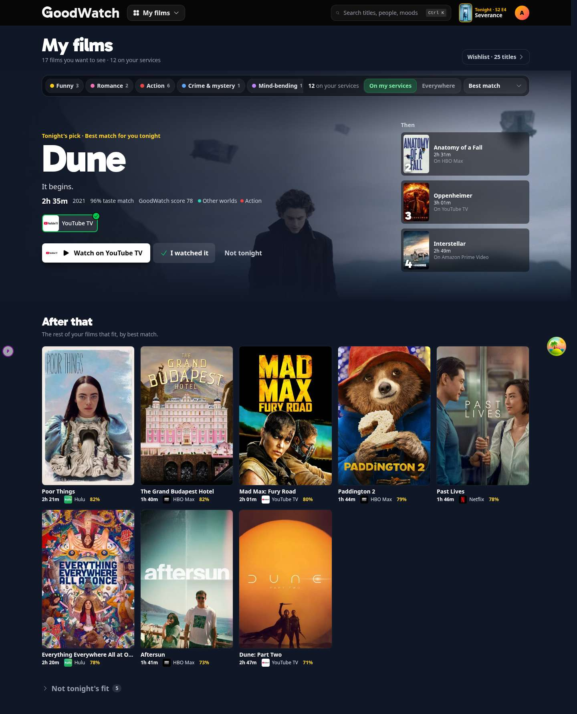

### B · By the time you have (`films=time`)

The page asks "How long have you got?". Each film is a bar as long as it runs, against the line of the chosen time;
what runs over is hatched and sinks below. Tonight's pick is the best match that fits, with the time it would end.

- Strongest: it uses what is true of films and not of shows: the evening has a length, and the page shows at a
  glance what fits.
- Weakest: posters shrink to thumbnails, so it is the least inviting to browse, and it adds a fourth control beside
  moods, services and the sort.

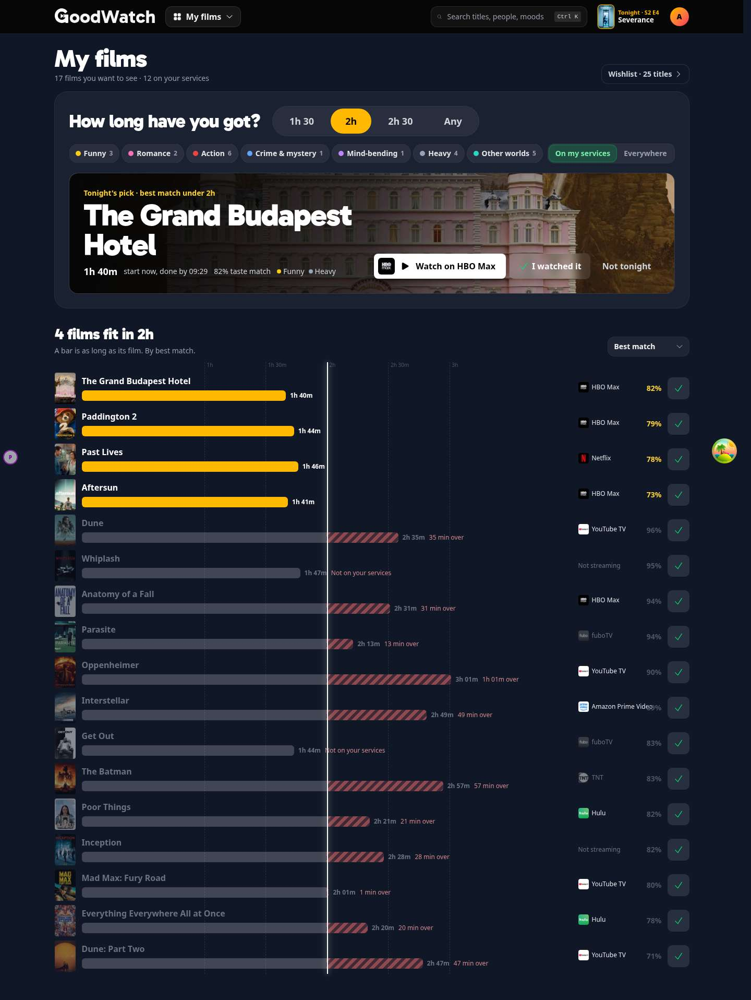
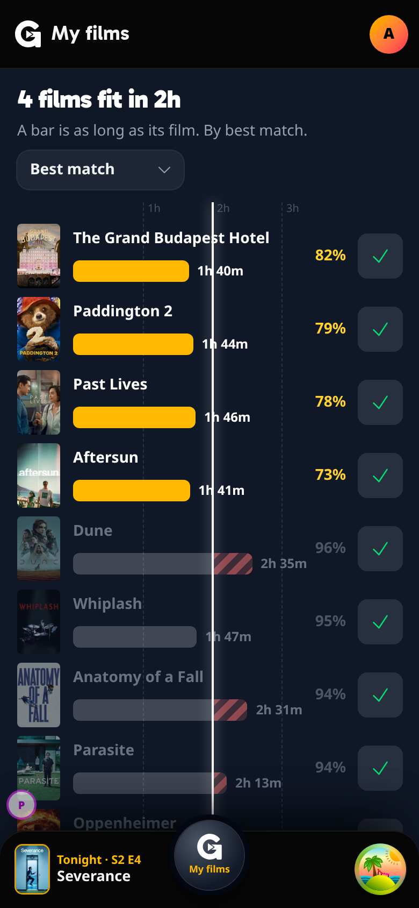

### C · Side by side (`films=compare`)

A table with one column per thing the choice rests on: runs, streams on, taste match, mood, score. The column heads
are the sort; moods and On my services are chips above it. On a phone the rows become cards and the sort a menu.

- Strongest: for a long list it is the fastest way to compare, and the sort explains itself by where you tap.
- Weakest: it is a spreadsheet; nothing on it makes a film look worth watching, and only three of the five sorts
  have a column.

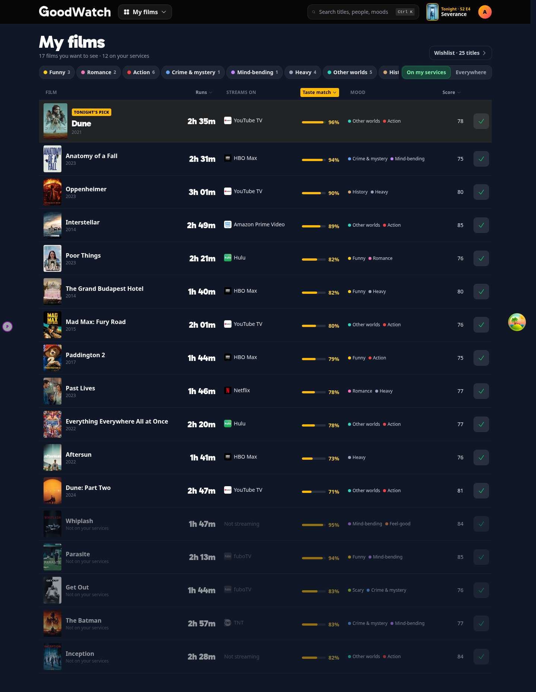

## 4. The Wishlist

### A · Behind both pages (`wishlist=behind`)

The Wishlist stays a page: everything the person wants to see, films and shows together, complete and plain. It has
no hero and no pick; two doors at its top lead to My films and My shows, and both pages link back to it.

- Strongest: one place still holds everything, so a count, a share, an import, or "did I add that?" has an answer.
- Weakest: it is a third page with little to do on it, and the person has to learn that picking happens elsewhere.

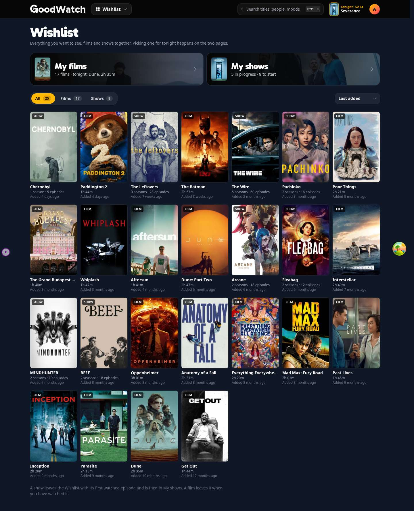

### B · Dissolved into the two (`wishlist=dissolved`)

There is no Wishlist page. Want to See puts a film in My films and a show under Start in My shows. The surface shows
what a member meets where the Wishlist used to be: where an old link lands, what the toast and the Want to See key
say, and the account menu without it.

- Strongest: one page fewer, and Want to See has an obvious destination.
- Weakest: nothing shows films and shows together, guests (who can't track episodes) get a My shows that is only a
  start list, and "Wishlist" survives as a word with no place.

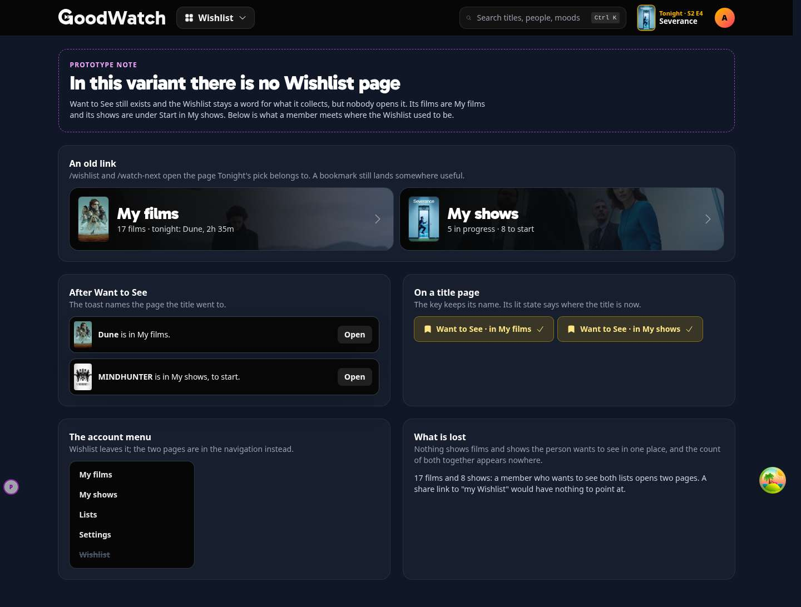

## What it means for the glossary

`CONTEXT.md` is not edited. Current wording of the three terms:

> **Wishlist**: The person's collection of titles marked Want to See. It has no manual order; the person chooses a sort.
>
> **Watch next**: The top of the Wishlist under the person's chosen sort and moods. It is a view of the Wishlist, not a
> separate list, and nothing but Want to See adds to it.
>
> **Tonight's pick**: The single title GoodWatch puts forward for tonight: for a member, the first title of Watch next.

### The two pages (every variant)

> **My shows**:
> The page for a member's shows: the Next episode of each Watching show, Seen shows with new episodes, shows waiting
> for episodes, On hold shows, and the Want to See shows they have not started.
> _Avoid_: Shows, Watchlist, Continue watching, Up next, Library
>
> **My films**:
> The page for choosing a film: the person's Want to See films under their chosen sort, moods and On my services. A
> film leaves it when it is Seen.
> _Avoid_: Films, Movies, Watchlist, Queue, Library

"Shows" and "Movies" without "My" are taken: `/shows` and `/movies` are the catalog pages and sit in the Browse panel
under those names. A show to start needs no term of its own: a Want to See show has no watched episode by rule,
because the first watched episode clears Want to See.

### Wishlist

With the Wishlist behind both pages, one sentence is added:

> **Wishlist**: The person's collection of titles marked Want to See, films and shows together. It has no manual
> order; the person chooses a sort. My films lists its films and My shows lists its shows.

With the Wishlist dissolved:

> **Wishlist**: The titles a person has marked Want to See. It has no page: its films are My films, and its shows are
> the shows to start in My shows.

### Watch next

Watch next can't stay "the top of the Wishlist" once the top is chosen per page. Proposed, for either Wishlist answer:

> **Watch next**: The top of My films, or of the shows to start in My shows, under the person's chosen sort and moods.
> It is a view of the Want to See titles of one kind, not a separate list, and nothing but Want to See adds to it.
> _Avoid_: Queue, Up next, Priority queue

Under home A and B the name no longer appears on screen (the tiles are Continue, Start a show, A film, and the page
`/watch-next` becomes My films). The term could then be dropped; home C keeps it on its tile.

### Tonight's pick

Home A, and the header and dock in A and B (one pick, round 1's rule with films in place of the Wishlist):

> **Tonight's pick**: The single title or episode GoodWatch puts forward for tonight. For a member, the Next episode
> of the Watching show they watched most recently in the last 30 days; without one, the first film of My films;
> without one, the first show to start.

Home B (one pick per intent):

> **Tonight's pick**: The title or episode GoodWatch puts forward for one intent tonight: the Next episode to
> continue, the show to start, or the film.

Home C (a pair):

> **Tonight's picks**: The Next episode and the film GoodWatch puts forward for tonight, one of each. A member with no
> Next episode gets the first show to start in its place.

## Recommendation

**Home A, My shows A, My films A with B's time choice in its strip, Wishlist A.**

1. Home A is the owner's sentence on the screen: continue, start, or a film, with no added row and no step between
   the tile and the page. B shows more but puts a step in front of every page; C leaves the living room without the
   paths. From C, take the Browse panel entries, which every variant needs, and consider the Remote's split key.
2. My shows A. The person who continues is served at once, and the start list is one scroll away with its costs in
   view. B's switch repeats a choice home A already took: its doors can land on the right part of A's page instead
   (the Start door scrolls to "Start a show", as it does in the prototype). B's table is worth keeping as the "all to start" view if start lists
   grow long. C's mixed order is the weakest idea of the round.
3. My films A is the shipped page and loses nothing. B's question is the one new idea that is specific to films, and
   it does not need B's layout: "How long?" can be a fourth choice in A's strip that moves films running over into
   "Not tonight's fit". The bars are worth a second look only if runtime turns out to be how the owner picks.
4. Wishlist A. It costs one plain page and keeps one answer to "everything I want to see", which guests, imports and
   sharing already assume. B saves a page and leaves a word without a place.

What this gives up: a member with 25 Watching shows gets A's cards, not B's calmer list, and the phone TV in home A
shows Something new only in the menu.

## Questions to answer by looking

1. **Home: three doors, one pick with three intents, or the paths in the navigation?** Compare `home=doors`, `rail`
   and `nav` on desktop and phone. Suggested answer: three doors.
2. **Is Something new still a tile on home?** In A it is a text key (desktop) or in the menu (phone) while there is
   something to continue. Suggested answer: no; it returns as the third tile when nothing is in progress.
3. **My shows: does continue lead, or does the page start with a Continue | Start switch?** Compare `shows=lead` and
   `shows=switch`, with 6 and with 25 shows. Suggested answer: continue leads, and home's Start door scrolls to the
   start list.
4. **What does starting a show cost, in the owner's eyes?** The cards and B's table show seasons, episodes, hours in
   all, ended or still running, and the service. Suggested answer: keep all five; hours in all is the one that
   decides.
5. **My films: is "How long have you got?" worth a control?** Try `films=time` at 1h 30, 2h and 2h 30. Suggested
   answer: yes as a choice in the strip of A, not as the page's layout.
6. **Does the Wishlist stay a page?** Compare `wishlist=behind` and `wishlist=dissolved`, and the links on My films
   in both. Suggested answer: yes, plain and behind both.
7. **Are the pages called My shows and My films?** Look at the header, the dock and the Browse panel, where Movies
   and Shows already name the catalog. Suggested answer: yes.
8. **One Tonight's pick or a pair?** Compare the header and the dock in `home=doors` and `home=nav`. Suggested answer:
   one, and it may be an episode, as round 1 proposed.

## Checked

The dev server ran against the worktree (`remix vite:dev`, port 3072, with only `TMDB_API_KEY` in its environment)
and headless Chromium opened every variant of every piece at 1440 x 900 and 390 x 844, with the sample members of 6,
25 and none on the pieces where they differ and the member of 1 on My shows A. A script ran 48 checks with no failure
and no page error: Watched on the home tile and Undo; the doors opening their pages; the Remote's wheel, OK, and split
key; the pair in the header; in My shows the hero advancing to the following episode, Not tonight, a show becoming
caught up, a Wishlist show starting and moving to Watching, an On hold show returning to Watching, the switch and its
default for a member who tracks nothing, the start sort, the mixed list, and a show watched through with the prompt to
rate; in My films Not tonight, I watched it, Everywhere, a mood, the sort, the time choice and the column-head sort;
the Wishlist filter and doors; the links disappearing when the Wishlist is dissolved; the Browse panel; the arrow
keys; and the State panel. The prototype made no request other than GET; in some runs the app shell's own Sentry tunnel (`POST /api/e`) fired once,
which the prototype does not call. Screenshots of five of these runs: `interaction-*.jpg`.

`biome lint` passes on the new files. `tsc` reports no error in them; the repo has 220 earlier errors in other files.

Not checked: a production build (the route matches the existing `prototype.watching*` exclusion and the new ui
directory was added to `PROTOTYPES` in `vite.config.js`, but no build was run), phone landscape, keyboard and screen
reader use, guests, the real TV flow (the home is drawn on the room, not wired into `tv-flow`), and the performance
budget, since nothing here touches a shipped surface.

## Files

- `goodwatch-webapp/app/routes/prototype.watching-2.tsx`: the route.
- `goodwatch-webapp/app/server/prototype-watching-2.server.ts`: round 1's fixture plus more titles and the facts.
- `goodwatch-webapp/app/ui/prototype-watching-2/`: `model.ts` (variants, picks, lists), `home.tsx`, `shows.tsx`,
  `films.tsx`, `wishlist.tsx`, `room.tsx`, `chrome.tsx` (header, dock, Browse panel, prototype controls), `bits.tsx`.
- Reused from round 1, unchanged: `ui/prototype-watching/model.ts` and `kit.tsx`, `server/prototype-watching.server.ts`.
