# The Wishlist and what you have already watched

Round 3 of the prototype for [#371](https://github.com/alp82/goodwatch-monorepo/issues/371), part of the map
[#365](https://github.com/alp82/goodwatch-monorepo/issues/365). Throwaway code. Round 2 is untouched at
`/prototype/watching-2` ([notes](../watching-2/README.md)), round 1 at `/prototype/watching`.

## The question

The owner's verdict on round 2:

> home A. shows C (watched button is too invasive here, whole row should go to title page instead). films A (should
> be "movies" not films). wishlist A but i would like to see variants where it is possible to switch between the
> wishlist and what i watched already

So three pieces are decided and built as fixed, and one is open:

**How does a member get from the Wishlist to what they have already watched, and what is that second place for?**

## How to open it

```
cd goodwatch-webapp
REC_NAVIGATION=on REC_WATCH_NEXT=on npm run dev
```

Then open `http://localhost:3003/prototype/watching-3`. The loader reads TMDB with `TMDB_API_KEY` from the usual
`.env`. The route answers 404 in production.

| Parameter | Values | Meaning |
|---|---|---|
| `surface` | `home`, `shows`, `movies`, `wishlist` | Which piece is on screen. |
| `wishlist` | `switch`, `diary`, `library`, `page` | The open piece, variants A to D. |
| `side` | `want`, `seen`, `unrated`; under C also `watching`, `onhold`, `dropped` | Which half of the Wishlist area shows. |
| `seen` | `30`, `1500`, `0` | The sample member's Seen history: 30 titles, 1,500 (an importer), or none. |
| `member` | `six`, `one`, `many`, `none` | The sample member's shows, as in round 2: 6, 1 or 25 Watching, or none. |
| `tick` | `on` | The shows list gets a small quiet tick at the end of each row. Default: none. |
| `chrome` | `off` | Hides the prototype's own controls. Worth doing on a phone, where they cover a third of the screen. |

The white controls with the fuchsia ring are the prototype's own: the surfaces, the sample member, the Seen history,
**Quiet tick** (on My shows), **State** (the picks, the shows list in its order, every status and the latest Seen
titles with their watches, after each action), **Reset**, **Hide**, and the pill that switches the Wishlist variant
(the left and right arrow keys do the same and bring the Wishlist on screen). Everything else is the design, including
the site header, the phone dock and the Browse panel.

The pieces are wired together. Things to try:

- On home, the three doors. **Start a show** lands on the Start group of the list.
- On My shows, click anywhere on a row. Slow Horses and Chernobyl open the episode list prototype
  (`/prototype/episode-list-2?variant=B&show=…`); the other shows open a stand-in for the title page, where
  **Watched** marks the Next episode. Then turn **Quiet tick** on and mark an episode from the row.
- On My movies, choose **Up to 2h** under "How long?" and open "Not tonight's fit". Tap **I watched it**, then go to
  the Wishlist and switch to Seen: the movie is first, with "Today, just now" and a Rate key.
- In any Seen view, tap a score or a **Rate** key: one bar with ten keys. The count of titles not rated goes down.
- Switch the Seen history to 1,500 and repeat.

## What is real and what is made up

- Posters, backdrops, episode names, runtimes, seasons and the first US subscription service come from TMDB through
  the loader, as in rounds 1 and 2. This round adds 25 list requests (TMDB's most voted movies and shows, 20 a page),
  read once and kept in memory: about 500 well-known titles a sample member could have Seen.
- Made up, in the browser, from seeds: which of those titles a member has Seen, when, how often, from which import,
  and their scores. The member with 30 marks what they watch: the latest 14 watches have a time, 9 a day, 4 came from
  Letterboxd with a day, 3 from IMDb without a date; three titles have a second watch and five no score. The importer
  has 1,500: about 38 in 100 without a date (an IMDb ratings import), about half with a day from Letterboxd or Trakt,
  the rest marked here; 224 have no score. **The pool holds 500 titles, so in the importer's history each title
  appears three times.** That member is for the size of the list, not for its content.
- A watch reads as the [watch log prototype](../watch-log/README.md) defines it: "6 Oct 2026, 21:40" for a watch
  recorded at the moment, "12 Mar 2019" for a day, "Date unknown" otherwise, and "Imported from Letterboxd" on a
  second line. A watch never gets a date nobody recorded: undated watches are never placed in a month or a year.
- The tracked Seen shows of the sample member (Only Murders in the Building, The White Lotus) are part of Seen. One
  show (Dark) is Dropped in this round so that the status has an example; in round 2 it was On hold.
- Every action stays in React state: watched episodes and movies, scores, "Not tonight". A reload starts over.
  Nothing is read from or written to a database or cache, and no mutation endpoint is called.
- Leaving for `/prototype/episode-list-2` leaves this prototype: that page has its own state, and what is marked
  there doesn't come back to the list.

## What is fixed

### Home: three doors

Round 2's variant A unchanged, with **A movie** where it said "A film": Continue (with its Watched key on the tile),
Start a show, A movie. Something new stays a text key in the head line.

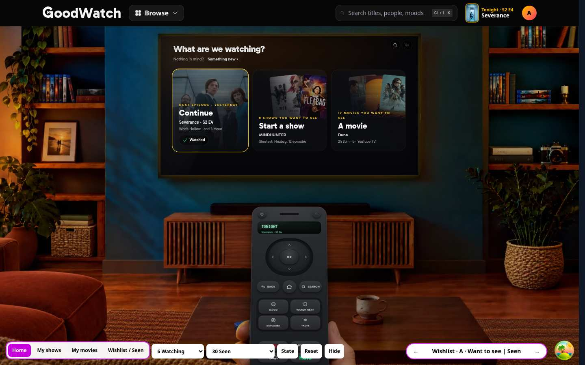
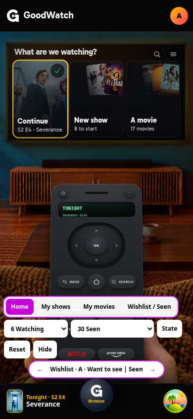

### My shows: one list for tonight

Round 2's variant C with the two changes asked for.

**The row is the link.** The large Watched button is gone. The whole row opens the show's title page, and a chevron
at its end says so. What remains of the one-tap mark is a switch to feel the difference:

- `tick` off (default): nothing. Marking an episode watched happens on the title page.
- `tick=on`: a 40 px outlined tick before the chevron. It is grey until hovered, marks the Next episode watched,
  shows the toast with Undo, and does not open the row.

**The order is one rule, and the page states it.**

1. **Continue** comes first: every show with a Next episode that was watched in the last 30 days, the one watched
   last on top. Seen shows with new episodes follow at the end of this group.
2. **Start** comes second: the Want to See shows the member has not started, best taste match first.

Nothing is interleaved. Round 2 put a show to start after every third show in progress, which nobody could guess.
Now a place in the list is explained by its group label ("Continue · last watched first", "Start · best taste match
first") and by one fact at the end of the row: "Watched yesterday" or "91% taste match". The sentence under
"Tonight" says the rule in words, and "Continue" and "Start" in it jump to their group. The numbers run through both
groups, so it still reads as one list.

What the rule gives up: a member with many shows in progress finds the first show to start further down (place 10 for
the member with 25 Watching shows: 8 of them were watched in the last 30 days, and one Seen show has new episodes). Home's Start door and the jump link
land on the group directly.

Under the list, as in round 2: "Not watched for 30 days" (closed), "Waiting for episodes", "On hold" (closed).

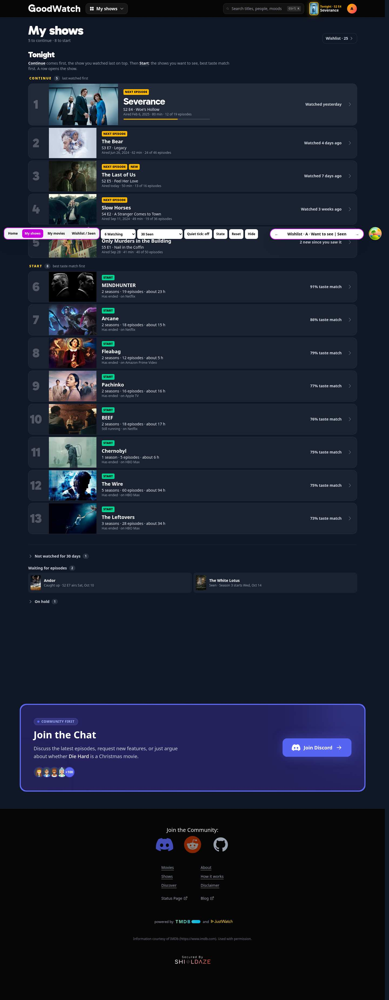
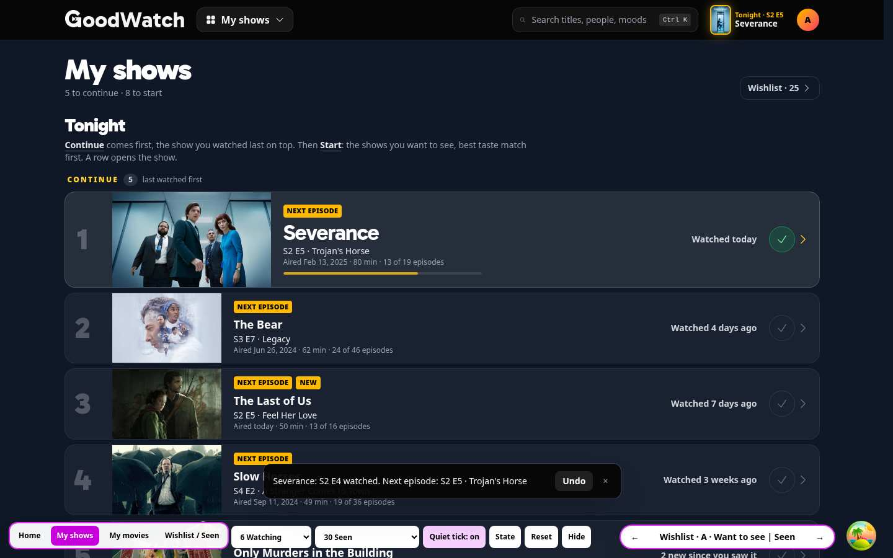

Phone: [list](shows-phone.jpg), [with the tick](shows-tick-phone.jpg). 25 Watching shows:
[list](shows-25-desktop.jpg). None: [list](shows-none-desktop.jpg). The stand-in for the title page:
[screenshot](title-stub-desktop.jpg).

### My movies: hero and tiers

Round 2's variant A. Every word the member reads says "movie": My movies, A movie, Tonight's movie, "17 movies you
want to see". The strip has one more choice, **How long?** (Any length, Up to 1h 30, Up to 2h, Up to 2h 30). A movie
that runs longer moves to "Not tonight's fit" and says by how much ("35 min over"), and the line over the hero says
what the pick is ("Best match for you tonight, under 2h").

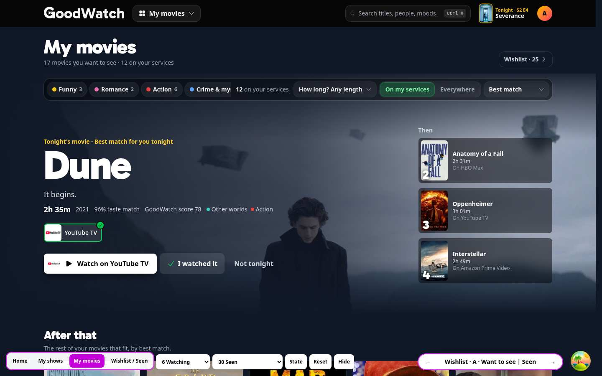
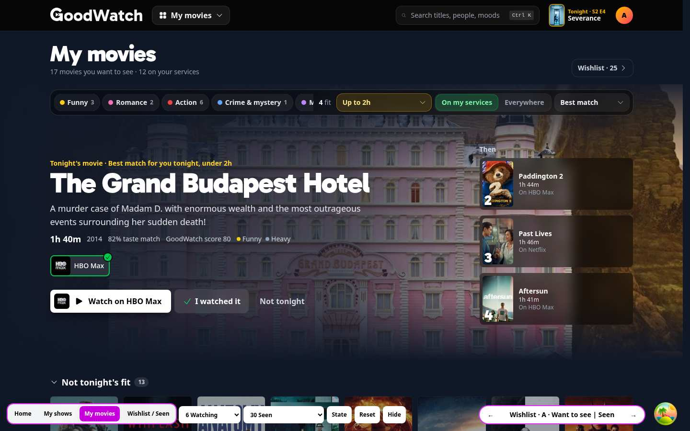

Phone: [page](movies-phone.jpg), [with a time](movies-time-phone.jpg).

## The open piece: the Wishlist and what you watched

What the watched side is for, in the order the variants serve it:

1. Checking whether you have seen something ("Have I seen…?").
2. Finding a title to rate or re-rate.
3. Remembering what you watched and when.
4. Reading it as a diary.
5. Seeing where you stand with shows.

All four variants have the Seen sorts (**Last watched**, **My score**, **Title**), a filter for movies or shows, a
search over the list, a quiet way to the Seen titles without a score, and draw a long list in steps. The Wishlist
half is round 2's plain page in all of them: everything, no pick.

### A · Want to see | Seen (`wishlist=switch`)

A two-way switch at the top of the page, and under it the same poster grid and the same controls for both halves; on
the Seen side a card carries the score on the poster and the date under the title. "5 not rated yet" is a small
switch under the controls, and a second one, "Shows in progress · 8", lets Watching, On hold and Dropped shows join
the grid with their status and progress.

- Strongest: nothing new to learn. It is one page with two states, and "Have I seen…?" is answered by looking.
- Weakest: a grid of posters says little about when. Dates are a line of small type, a second watch is a badge, and
  with 1,500 titles the page is a search box with posters under it.

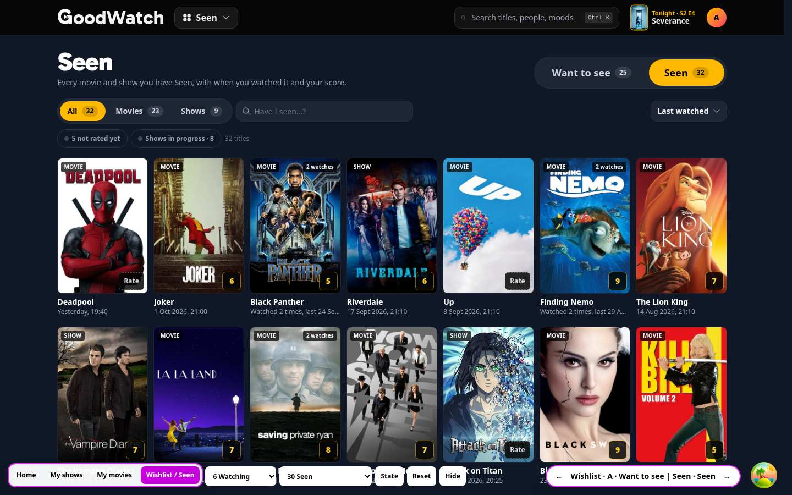
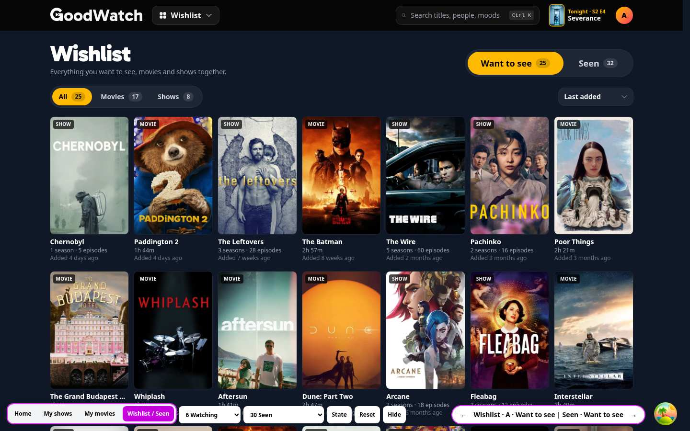

30 on a phone: [Seen](a-seen-30-phone.jpg), [Wishlist](a-want-phone.jpg). 1,500: [desktop](a-seen-1500-desktop.jpg),
[phone](a-seen-1500-phone.jpg). Not rated only: [desktop](a-unrated-desktop.jpg). The rating bar:
[desktop](rate-bar-desktop.jpg), [phone](rate-bar-phone.jpg).

### B · Wishlist and a diary (`wishlist=diary`)

The same switch, but the other half is a diary: one row per watch under month heads, with the day large at the left,
the time where one was recorded, "Imported from …" on a second line, a Rewatch tag on a second watch, and the score
at the end. Watches without a date are a last group, "Date unknown", closed when it is long. Episodes of shows in
progress are rows too (a switch turns them off), and a rail of years jumps through the history. Under **My score**
or **Title** the diary turns into a list of titles.

- Strongest: it is the only variant that answers "what did I watch, and when" at a glance, and the only one where the
  watch log's dates, rewatches and imports are the content, not a footnote.
- Weakest: for an importer the diary is mostly not a diary: 38 in 100 watches have no date and sit in one closed
  group, and "have I seen it" needs the search, because a title is where its date is.

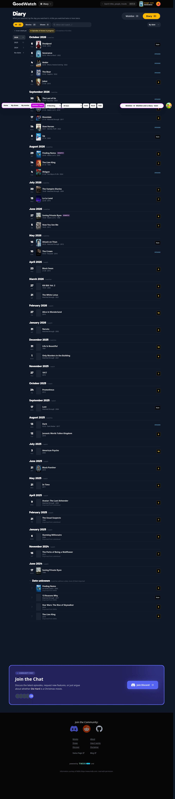

30 on a phone: [diary](b-diary-30-phone.jpg). 1,500: [desktop](b-diary-1500-desktop.jpg),
[phone](b-diary-1500-phone.jpg), [the Date unknown group](b-diary-unknown-1500-desktop.jpg).

### C · My library (`wishlist=library`)

One page with a chip per status and a count on each: Want to see, Watching, On hold, Dropped, Seen. The Wishlist is
the first chip. "Not rated" is a sixth, quieter entry under a rule. Rows, not posters: a Want to See row says when it
was added, a show in progress its Next episode, progress and last watch (and opens the show), a Seen row its date,
import and score.

- Strongest: every title the member has marked has exactly one place, the counts answer "where do I stand" on
  sight, and Dropped and On hold get a home they don't have anywhere else.
- Weakest: it puts Watching next to the Wishlist again, which round 1 tried and the owner rejected, and it turns
  the Wishlist from a page with a name into a chip. It is also the plainest to look at.

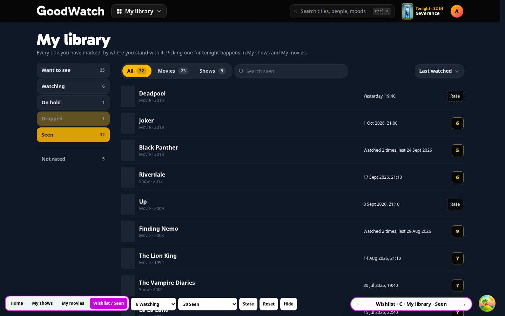
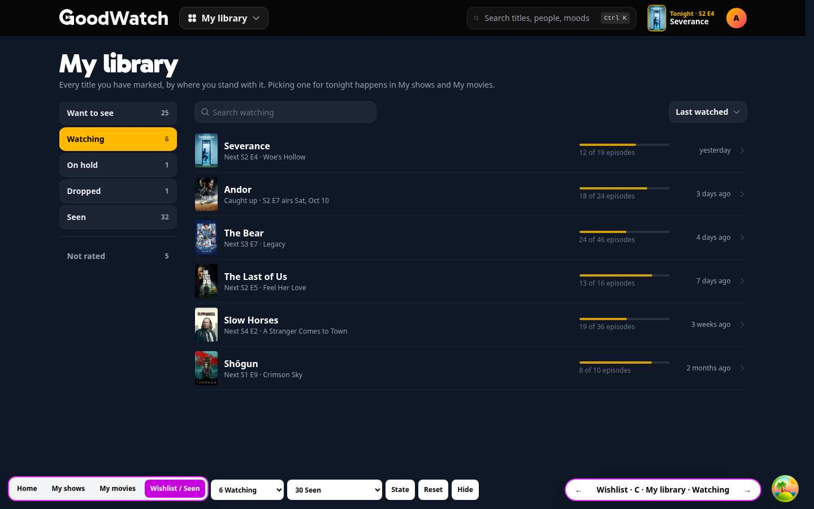

30 on a phone: [Seen](c-seen-30-phone.jpg), [Watching](c-watching-phone.jpg), [Want to see](c-want-phone.jpg);
desktop [Want to see](c-want-desktop.jpg). 1,500: [desktop](c-seen-1500-desktop.jpg),
[phone](c-seen-1500-phone.jpg).

### D · Seen as its own page (`wishlist=page`)

No switch. The Wishlist is exactly round 2's page; Seen is a page of its own, reached from the Browse panel and from
a link in the head of the Wishlist, My shows and My movies. It opens with a short "Rate these" row that can be put
away, then posters in groups that follow the sort: by year watched (with "Date unknown" last), by score, or by
letter. A long group starts with two rows of posters and opens in steps.

- Strongest: each page keeps one job and one name, and the Seen page has room for what only it needs: the row of
  titles to rate, and groups that make 1,500 posters scannable.
- Weakest: the two lists are two taps apart instead of one, the Browse panel gets a seventh tile, and nothing on the
  Wishlist shows that a movie you marked watched went somewhere.

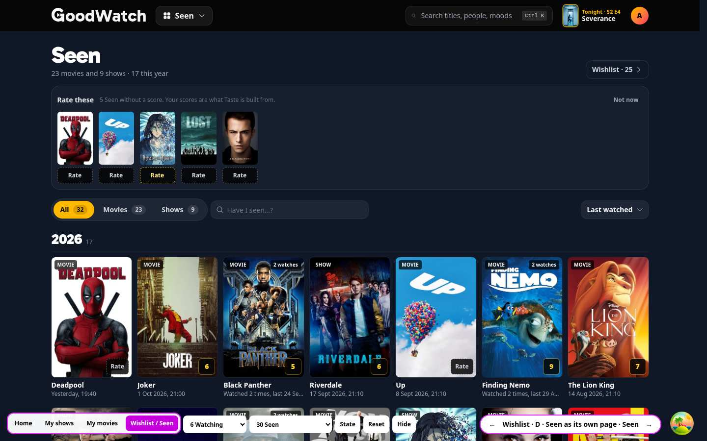
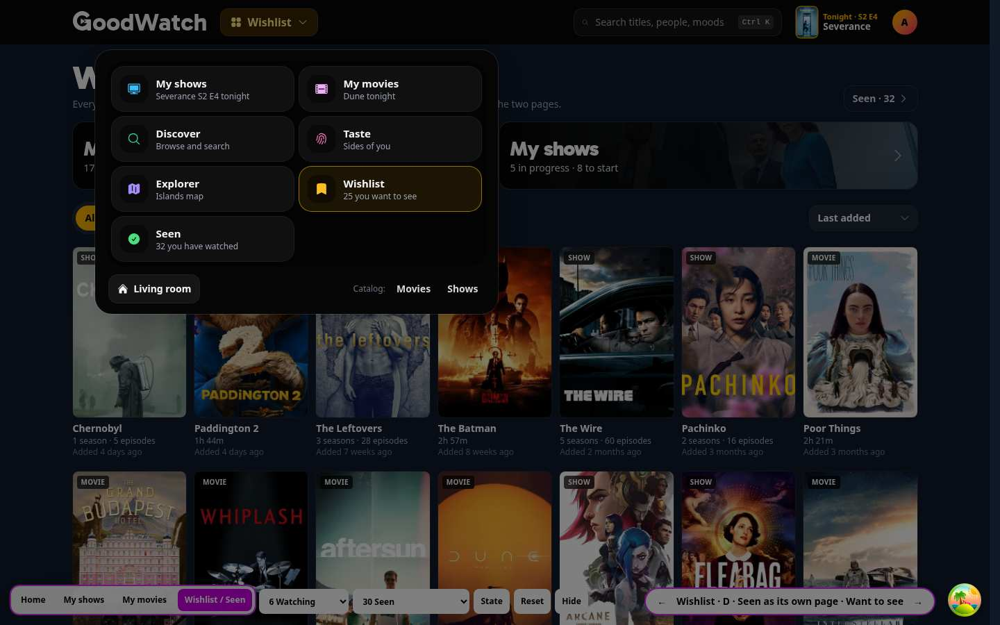

30 on a phone: [Seen](d-seen-30-phone.jpg), [Wishlist](d-wishlist-phone.jpg), [Browse](d-browse-phone.jpg); desktop
[Wishlist](d-wishlist-desktop.jpg). 1,500: [desktop](d-seen-1500-desktop.jpg), [phone](d-seen-1500-phone.jpg),
[by score](d-seen-score-1500-desktop.jpg).

### How each one surfaces unrated titles, and behaves at 30 and 1,500

| | Not rated | 30 Seen | 1,500 Seen |
|---|---|---|---|
| **A** | A small switch, "5 not rated yet", that filters the grid | One screen and a half of posters | 70 posters, then steps of 140; the search and the sort do the work |
| **B** | The same switch; in the diary an unrated watch has a dashed Rate key where the score would be | Every month since the first watch fits on one long page | 60 watches, then "Earlier" in steps of 120; a year rail; 563 undated watches closed in one group |
| **C** | Its own entry under the chips, "Not rated 5" | 32 rows | 60 rows, then steps of 120 |
| **D** | A row of up to ten posters with Rate keys, "Not now" puts it away, "All 224" filters the page | The groups show whole | Two rows of posters per year (or score, or letter), each group opens in steps of 140 |

Under **My score**, titles without a score come last everywhere; the nudge is how they are found.

## Does the watched side hold shows that are not Seen?

Seen movies and Seen shows are in it in every variant. Watching, On hold and Dropped are handled four ways so the
owner can compare: A offers them as a switch that is off; B has their episodes as diary rows and not the shows
themselves; C gives each status a chip; D leaves them out and says under the list that they are in My shows.

## What it means for the glossary

`CONTEXT.md` is not edited.

### Page names

> **My shows**:
> The page for a member's shows tonight: one list with the Next episode of each show to continue, then the Want to
> See shows to start; under it the shows waiting for episodes and the On hold shows.
> _Avoid_: Shows, Watchlist, Continue watching, Up next
>
> **My movies**:
> The page for choosing a movie: the person's Want to See movies under their chosen sort, moods, On my services and
> the time they have. A movie leaves it when it is Seen.
> _Avoid_: Movies, My films, Watchlist, Queue

"Shows" and "Movies" without "My" stay taken by the catalog pages `/shows` and `/movies`, which is one more reason
for "movie": the catalog, the routes (`/movie/…`) and the code already say it.

`CONTEXT.md`'s own prose says "film" in eight places. If "movie" becomes the word, these would change:

| Line | Now | Would read |
|---|---|---|
| 3, intro | discover films and TV shows | discover movies and TV shows |
| 8, Worthwhile suggestion | An appealing film or TV show | An appealing movie or TV show |
| 11, Interest discovery | Finding films and TV shows | Finding movies and TV shows |
| 55, Watch | One viewing of a film or of an episode | One viewing of a movie or of an episode |
| 63, Seen | A film the person has watched or rated | A movie the person has watched or rated |
| 67, Show status | Films have none. | Movies have none. |
| 153, Duplicate listings | the same underlying film or show | the same underlying movie or show |
| 179, Share list | exactly five films or shows | exactly five movies or shows |

Fingerprint (line 163) already says "movie or show". A line "_Avoid_: Film" under a new term **Movie** would settle
it.

### Wishlist

One sentence added to today's wording, whichever variant wins:

> **Wishlist**: The person's collection of titles marked Want to See, movies and shows together. It has no manual
> order; the person chooses a sort. My movies lists its movies and My shows lists its shows to start.

Under C it would also say "It is the first status of My library."

### The watched side

Proposed: **Seen**, the word the glossary already has for the state, used for the place as well.

> **Seen** (as a place): The person's Seen titles, movies and shows together, with the watches of each and the
> person's score. Shows that are Watching, On hold or Dropped are not in it.
> _Avoid_: Watched, History, Watch history, Diary, Library, Collection, Archive, Watchlist, Finished

Why not the others: "Watched" is what a single episode is, and a rated show is Seen without a watch. "History" and
"Diary" promise dates, which an importer mostly doesn't have. "Library" and "Collection" suggest ownership, and
"Collection" already means a film series in the catalog. "Watchlist" is what other services call the Wishlist.

If B wins, **Diary** becomes a term of its own ("The person's watches in the order of their dates; watches without a
date are listed apart"), and it names a view of Seen, not the place. If C wins, **My library** is the page and Seen
is one status in it.

### Watch next

Unchanged from round 2's proposal, with the word changed:

> **Watch next**: The top of My movies, or of the shows to start in My shows, under the person's chosen sort and
> moods. It is a view of the Want to See titles of one kind, not a separate list, and nothing but Want to See adds
> to it.

With home A the name no longer appears on screen, and the page `/watch-next` becomes My movies. The term could be
dropped.

### Tonight's pick

> **Tonight's pick**: The single title or episode GoodWatch puts forward for tonight. For a member, the Next episode
> of the Watching show they watched most recently in the last 30 days; without one, the first movie of My movies;
> without one, the first show to start.

It is the first row of the shows list whenever a show was watched in the last 30 days, so the header, the dock and
the list agree. On My movies the hero is labelled "Tonight's movie", so that the page doesn't claim the pick when the
pick is an episode.

## Recommendation

**D for the structure, with A's switch added as the link between the two pages, and B's diary as the "Last watched"
view of Seen once watches with dates are common.**

1. Seen deserves a page (D). The owner asked for a way to switch, and the four purposes behind the request (check,
   rate, remember, progress) are not the Wishlist's purposes. A page of its own has room for the row of titles to
   rate and for groups, which is what keeps 1,500 titles usable. A's single grid does not scale: it is the same
   page at 30 and at 1,500, and at 1,500 that page is a search box.
2. Keep the one-tap switch (from A). D's weakness is the distance. Put the two-way switch, Want to see | Seen, in
   the head of both pages in place of D's link: it then switches between two pages, each with its own layout,
   instead of between two states of one grid. This is the one thing not built as such; A shows the switch and D
   shows the pages.
3. The diary (B) is the best answer to "what did I watch and when", and the worst for an importer. Offer it as what
   **Last watched** looks like on the Seen page for members whose watches mostly have dates, and keep D's year groups
   for the rest. It is not needed for the first version.
4. Not C. Its counts are attractive, but it rebuilds the combined page round 1 was rejected for, and My shows
   already is the place for Watching and On hold. What C shows is that **Dropped has no home**: it needs a closed
   group at the bottom of My shows next to On hold.

Shows list: ship it without the tick. With the row as a link, the tick is the only second target in the row, and on
a phone it sits a thumb's width from the chevron. One tap to mark stays on home's Continue door and on the title
page.

## Questions to answer by looking

1. **A switch, or a page of its own?** Compare `wishlist=switch` and `wishlist=page`, both with `seen=1500`.
   Suggested answer: a page of its own, with the switch in the head of both pages.
2. **Is the watched side a grid, a diary, or rows?** Compare A, B and C with `seen=30`, then B with `seen=1500`.
   Suggested answer: a grid in groups; the diary later, as a view.
3. **Does it hold shows that are Watching, On hold or Dropped?** In A turn on "Shows in progress"; in C look at the
   chips. Suggested answer: no. They stay in My shows, and Dropped gets a closed group there.
4. **Is it called Seen?** Look at the header, the switch and the Browse panel in A and D, and "Diary" in B and "My
   library" in C. Suggested answer: Seen.
5. **How loud may "rate these" be?** Compare A's small switch, C's entry and D's row of posters. Suggested answer:
   D's row, shown while there are unrated titles watched in the last 30 days, and "Not now" puts it away for good.
6. **The shows list: no mark at all, or the quiet tick?** `surface=shows`, with and without `tick=on`, on a phone.
   Suggested answer: no tick. And is the order right: Continue, then Start, with nothing mixed?

## Checked

Against the dev server on `http://localhost:3003` (started with `REC_NAVIGATION=on REC_WATCH_NEXT=on` and the usual
`.env`), with system Chromium driven by Playwright, at 1440 x 900 and 390 x 844. A script ran 206 checks and all of
them passed:

- Home: the three doors exist, say "movie", and open My shows, My shows at the Start group, and My movies.
- My shows: the rule is stated, the two group labels exist, every Continue row is before every Start row, there is
  no Watched button and no tick by default, every row is a link, Slow Horses and Chernobyl link to
  `/prototype/episode-list-2?variant=B&show=…` and the click lands there, another row opens the stand-in, marking
  there advances the episode and the list shows it on return. With `tick=on`: a tick on every row, 40 px, it marks
  the episode, shows the toast, doesn't open the row, and Undo restores it. The members with 25, 1 and no shows
  render.
- My movies: no "film" in the text, "How long?" changes the pick line and fills "Not tonight's fit" with how far each
  runs over, "I watched it" moves on, and the movie is then first in Seen, not rated, dated today.
- Each Wishlist variant with 30 and with 1,500 Seen titles, desktop and phone: the halves and chips switch, the three
  sorts order correctly, the not rated filter matches its count, a score takes a title off that list, the search
  filters, lists grow in steps, the diary has watches with a time, with a day and without a date in their own group,
  imports are marked, a year jumps, D's groups follow the sort and its row of titles to rate can be put away. The
  empty Seen state renders.
- No page scrolls sideways on any of them.
- The arrow keys switch the variant and the State panel prints the state.

With 1,500 Seen titles nothing took longer than half a second from the click to the next painted frame: sorting 100
to 180 ms, filtering 190 to 350 ms, the search 50 to 75 ms, opening the Seen page 450 to 470 ms. The largest page
drew 266 posters and stayed under 6,000 DOM nodes; no variant draws 1,500 of anything.

The prototype made no request other than GET. In one run the app shell's own Sentry tunnel (`POST /api/e`) fired
once, which the prototype does not call.

`biome lint` passes on the new files and `tsc` reports no error in them.

Not checked, or with a caveat:

- The dev server restarted several times during the runs (it is run in a restart loop on this machine and shared
  with another prototype). Scenarios that were cut off were run again; every scenario passed in full at least once,
  but not all in one uninterrupted run. One page error was logged in such a moment (a Vite dependency chunk that
  failed to load after a restart).
- A production build, phone landscape, keyboard and screen reader use, guests, and the real TV flow (the home is
  drawn on the room, not wired into `tv-flow`).
- Real data: no real member's Seen list, watch log or scores were read. The 1,500 are 500 titles three times.
- The recommended combination (D's two pages with A's switch in both heads) is not built as such.
- The episode list round 3 (`/prototype/episode-list-3`) is being built in parallel; the rows link to round 2 of it.

## Files

- `goodwatch-webapp/app/routes/prototype.watching-3.tsx`: the route.
- `goodwatch-webapp/app/server/prototype-watching-3.server.ts`: round 2's fixture plus the pool of titles to have
  Seen.
- `goodwatch-webapp/app/ui/prototype-watching-3/`: `model.ts` (variants, watches, the made-up Seen histories, sorts
  and groups, the diary, the order of the shows list), `home.tsx`, `shows.tsx` (the list and the stand-in for the
  title page), `movies.tsx`, `wishlist.tsx` (the four variants), `seen.tsx` (page head, Seen card and row, the rating
  bar), `chrome.tsx` (header, dock, Browse panel, prototype controls).
- Reused unchanged: round 1's `ui/prototype-watching/model.ts` and `kit.tsx`; round 2's `model.ts`, `bits.tsx`,
  `room.tsx` and both fixtures.
