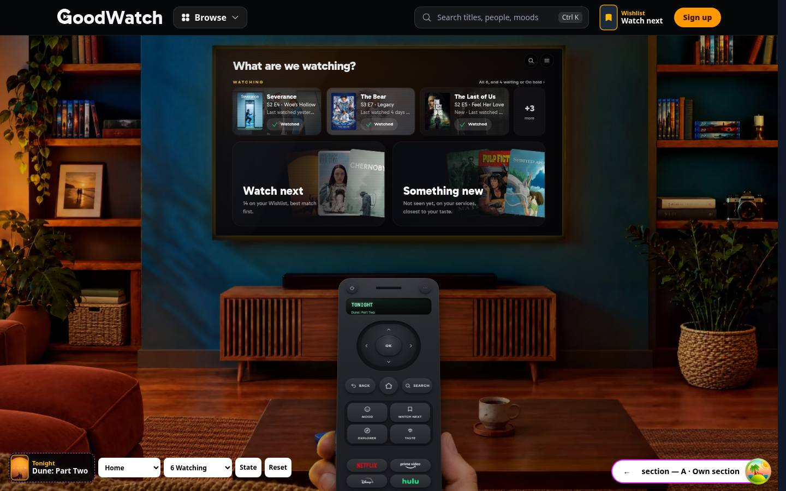
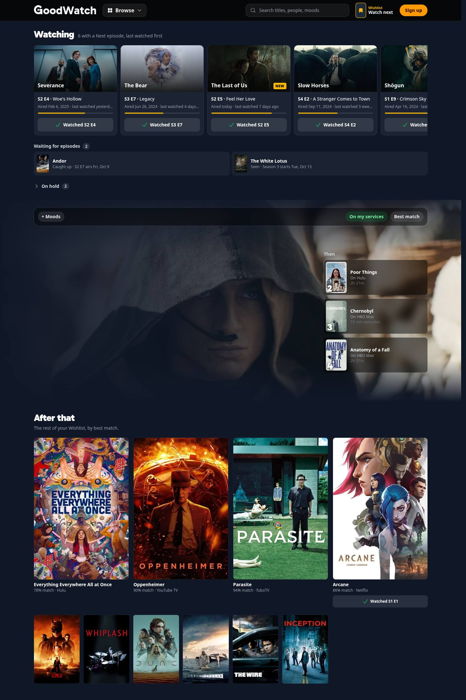
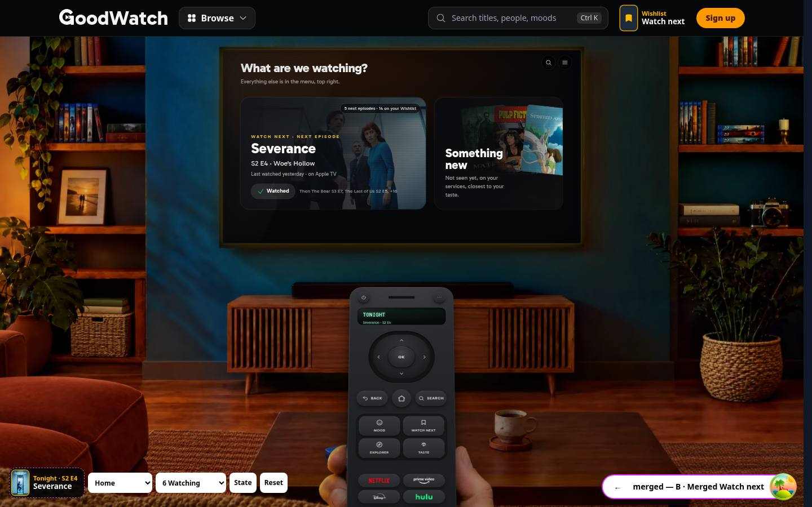
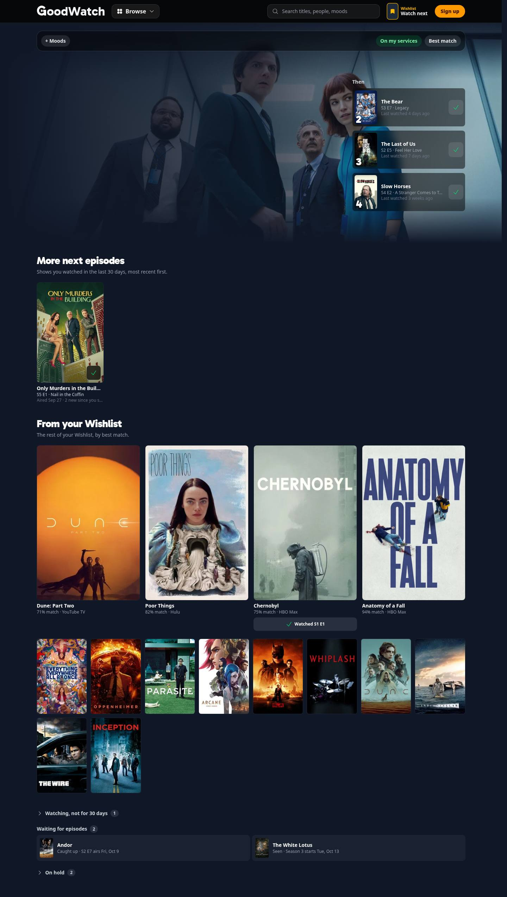
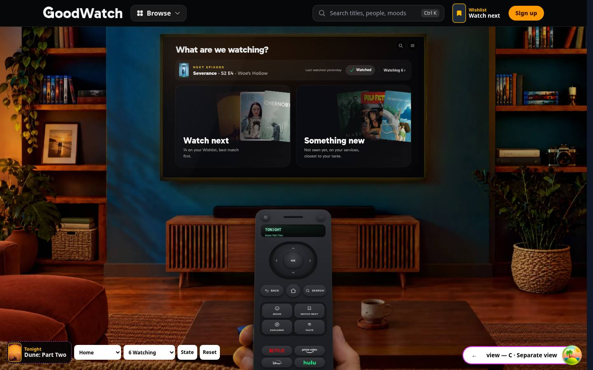
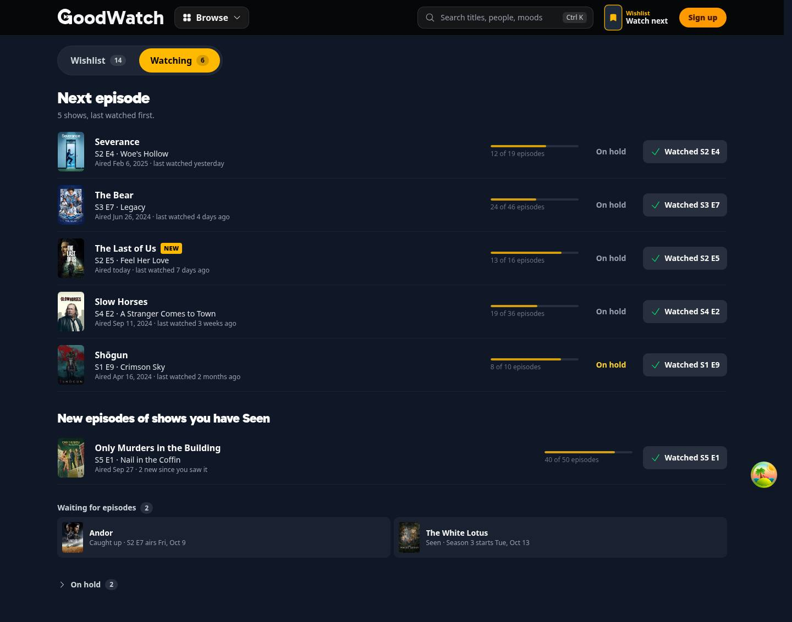
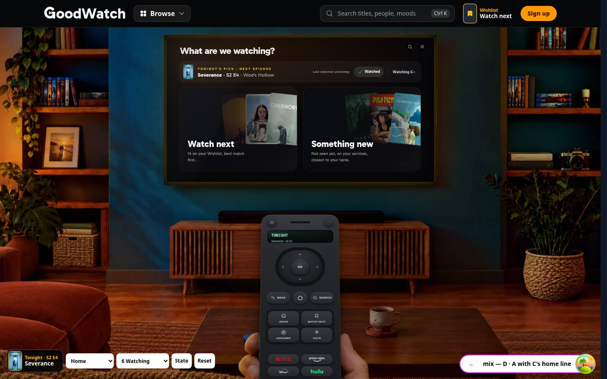
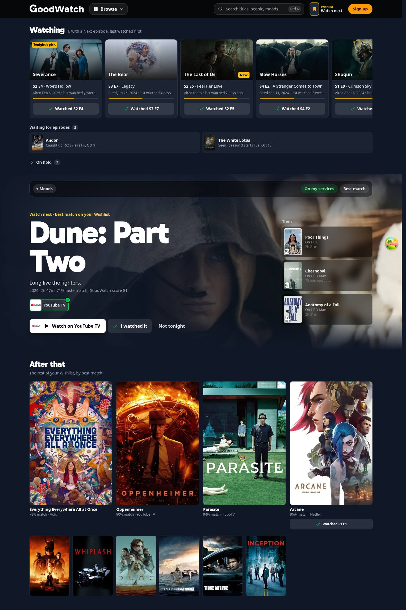

# Watching on home and beside the Wishlist

Prototype for [#371](https://github.com/alp82/goodwatch-monorepo/issues/371), part of the map
[#365](https://github.com/alp82/goodwatch-monorepo/issues/365). Throwaway code on the branch `prototype/watching`.

## The question

The glossary says Watch next is "a view of the Wishlist, not a separate list, and nothing but Want to See adds to it",
and Tonight's pick is the first title of Watch next. The settled rules say the first watched episode sets Watching and
clears Want to See. So a show a member is in the middle of leaves the Wishlist and can't be in Watch next, although it
is the most likely thing they watch tonight. Where do Watching shows live?

## How to open it

```
cd goodwatch-webapp
REC_NAVIGATION=on REC_WATCH_NEXT=on npm run dev
```

Then open `http://localhost:3003/prototype/watching`. The two flags only switch the header and the phone dock to the
shipped navigation; the prototype works without them. The route answers 404 in production.

| Parameter | Values | Meaning |
|---|---|---|
| `variant` | `section`, `merged`, `view`, `mix` | Variants A to D. The pill at the bottom, or the left and right arrow keys, switch. |
| `surface` | `home`, `wishlist` | The living room's member home, or the Wishlist area (today's `/watch-next` page). |
| `member` | `six`, `one`, `many`, `none` | A sample member with 6, 1 or 25 Watching shows, or one who tracks nothing. |
| `tab` | `watching`, `wishlist` | Variant C only: which of its two views shows. |

The white controls at the bottom are the prototype's own: the surface, the sample member, **State** (the full state
after every action: Tonight's pick, Watch next, and every tracked show with its stored status and what it is today),
and **Reset**. The dashed box left of them previews what the header and the phone dock would show as Tonight's pick.

Things to try: tap **Watched** on a card (the card moves on to the following episode, a toast offers Undo); tap it on
The Last of Us, whose newest episode aired today (the show becomes caught up and moves to "Waiting for episodes"); tap
it twice on Shōgun (the show is watched through, becomes Seen, and the one prompt to rate appears); open **On hold**
and tap Watched there (the show returns to Watching); pick "Tracks nothing" and start a Wishlist show from the empty
state (it becomes Watching and leaves the Wishlist).

## What is real and what is made up

- Posters, backdrops, episode names, runtimes and the first US subscription service come from TMDB, fetched by the
  loader with the server's key and kept in memory. The key never reaches the browser.
- What each sample member has watched, the "last watched" times, and the air dates of the shows that are airing are
  made up relative to today, so the page always has a caught-up show, a Seen show with new episodes, and a show whose
  season starts next week. Taste match numbers are made up.
- Every action stays in React state. A reload starts over. The route calls no mutation endpoint and reads or writes
  no database, cache or user table (checked: no request other than GET during a full run through the interactions).
- The home is the real room photo, TV geometry, canvas scale and Remote from `ui/living-room`, without the TV flow:
  the Remote's keys do nothing here. The Wishlist area is drawn after `ui/watch-next` (hero, Then column, tiers); the
  moods, On my services and sort controls are drawn only.
- Cards use the show's backdrop or poster, never an episode still, because stills of unwatched episodes stay hidden.

## The sample member with six shows

| Show | State today | What the card says |
|---|---|---|
| Severance, The Bear, Slow Horses | Watching, with a Next episode | Season and episode, name, air date, last watched yesterday, 4 days ago, 3 weeks ago |
| The Last of Us | Watching, newest episode aired today | The same, with a New badge |
| Shōgun | Watching, not watched for 2 months, two episodes left | The same; in B it falls behind the Wishlist |
| Andor | Caught up | "Caught up · S2 E7 airs Fri, Oct 9" |
| Only Murders in the Building | Seen, two new episodes | "Seen · 2 new since you saw it" |
| The White Lotus | Seen, a season starts next week | "Seen · Season 3 starts Tue, Oct 13" |
| The Crown, Dark | On hold | A closed group, "On hold 2" |

## The variants

Each has screenshots at 1440 and 390 pixels wide: `<variant>-home[-25|-1|-none]-<desktop|phone>.jpg` and
`<variant>-wishlist[-25|-1|-none]-<desktop|phone>.jpg`. No suffix is the member with six shows.

### A · Own section (`variant=section`)

Watching is its own section. Watch next stays a view of the Wishlist.

- **Home:** a Watching row above the two tiles: three shows on the desktop TV, two on the phone TV, then "+N". Each has
  the Next episode and a Watched key. The tiles shrink to make room.
- **Wishlist area:** a Watching shelf above the hero, last watched first, with Seen shows that have new episodes at
  its end. Under it "Waiting for episodes" (caught up, and a season that starts on a date), then On hold, closed. The
  hero, Then and the grid are the Wishlist, unchanged.
- **Tonight's pick:** unchanged, the first Wishlist title. A member in the middle of Severance is offered Dune.
- **25 shows:** the shelf shows eight, "+18" opens the rest as a wrapped grid that pushes the hero far down.
- **Tracks nothing:** home is today's home. The Wishlist area shows a dashed note where the section would be, with the
  member's Wishlist shows to start.




### B · Merged Watch next (`variant=merged`)

Watch next includes the Next episodes of Watching shows ahead of Wishlist titles.

- **Home:** the Watch next tile leads with the Next episode, its Watched key, and "Then …".
- **Wishlist area:** the hero is the Next episode of the show watched most recently. Then holds the next three places,
  episodes or titles. Below: "More next episodes", "From your Wishlist", then closed "Watching, not for 30 days",
  "Waiting for episodes", and On hold.
- **Tonight's pick:** the Next episode ("Tonight · S2 E4, Severance"). "Not tonight" moves on to the next show.
- **25 shows:** without a limit the Wishlist would start at place 26. The prototype lets only shows watched in the last
  30 days lead (8 of the 25); the other 17 sit in a closed group under the Wishlist.
- **Tracks nothing:** exactly today's page. A Wishlist show in the hero gets a second key, "Watched S1 E1".
- Not shown, and a cost of this variant: the sort, the moods and On my services would each need a rule for episodes
  (does Top rated reorder the shows a member is watching? Does a mood hide the Next episode?).




### C · Separate view (`variant=view`)

Watching is a second view beside the Wishlist. Home has one line.

- **Home:** one line above the two tiles: the Next episode of the show watched most recently, a Watched key, and
  "Watching 6 ›". The tiles keep their size on desktop.
- **Wishlist area:** two tabs, Wishlist and Watching. Wishlist is today's page. Watching is a plain list with no hero:
  "Next episode" rows with progress and an On hold action, "New episodes of shows you have Seen", "Waiting for
  episodes", and On hold, closed.
- **Tonight's pick:** unchanged, the first Wishlist title.
- **25 shows:** a long list, which a list handles: every row is one line of facts and one key.
- **Tracks nothing:** the Watching tab shows 0 and the note with Wishlist shows to start.




### D · A with C's home line (`variant=mix`), the recommendation

After building A to C: A's section beside the Wishlist, C's one line on home, and one change to Tonight's pick.

- **Home:** C's line, named "Tonight's pick · Next episode".
- **Wishlist area:** A's page. The first shelf card carries a "Tonight's pick" tag; the hero is the first title of
  Watch next and says so.
- **Tonight's pick:** the Next episode of the Watching show watched most recently in the last 30 days; without one,
  the first title of Watch next.




## What each variant means for the glossary

Current wording:

> **Watch next**: The top of the Wishlist under the person's chosen sort and moods. It is a view of the Wishlist, not a
> separate list, and nothing but Want to See adds to it.
>
> **Tonight's pick**: The single title GoodWatch puts forward for tonight: for a member, the first title of Watch next.

**A and C: no change to either.** Both need a name for the place, which the glossary's Watching can carry by adding
one sentence: "The Watching shows are listed together, last watched first, each with its Next episode." The cost is
visible in the prototype: Tonight's pick never names the show a member is in the middle of.

**B: both change.**

> **Watch next**: What the person is most likely to watch next: the Next episodes of the Watching shows they watched
> in the last 30 days, most recently watched first, then the top of the Wishlist under their chosen sort and moods.
> Want to See and watching an episode add to it.
>
> **Tonight's pick**: The single title or episode GoodWatch puts forward for tonight: for a member, the first place of
> Watch next.

Watch next stops being a view of the Wishlist, so the Wishlist needs its own page or name again, and "the sort and
moods" have to say what they do to episodes.

**D: only Tonight's pick changes.**

> **Tonight's pick**: The single title or episode GoodWatch puts forward for tonight. For a member, the Next episode
> of the Watching show they watched most recently in the last 30 days; without one, the first title of Watch next.

Watch next keeps its wording. Watching gets the same added sentence as in A and C.

## Recommendation

D. Reasons, each visible in the prototype:

1. The show a member is in the middle of belongs in Tonight's pick, which is in the header and the dock on every page.
   A and C leave it out; B gets it by redefining Watch next.
2. Watch next as "a view of the Wishlist" is shipped, and its sort, moods and On my services have no meaning for
   episodes. B has to invent rules for each. D leaves them alone.
3. The TV is small. A's row of three cards prints its facts at about 9 pixels on a 1440 pixel window and drops the
   episode name on a phone. C's single line stays readable on both and leaves the tiles their size.
4. Beside the Wishlist, one page answers "what do I watch tonight": the shelf, then the Wishlist. C's tab hides the
   Watching shows behind a tap on the page a member opens to choose.

What D gives up: with 25 shows the shelf is weaker than C's list. If many members track that many shows, C's list
could become the shelf's "all" view.

## Questions to answer by looking

1. **Should Tonight's pick be able to be an episode?** Compare the dashed preview in A and D with a member of six.
   Suggested answer: yes.
2. **Should Watch next stay a view of the Wishlist?** Compare the Wishlist area in B and D. Suggested answer: yes; B's
   mixed list needs rules for sort, moods and services that nobody asked for.
3. **Home: a row of shows, or one line?** Compare home in A and C on desktop and phone. Suggested answer: one line.
4. **Beside the Wishlist: a shelf above the hero, or a second tab?** Compare the Wishlist area in A and C, with 6 and
   with 25 shows. Suggested answer: the shelf, above the hero.
5. **Does a show the member has not watched for a while keep leading?** Shōgun (2 months) in B, and the member with
   25. Suggested answer: no; after 30 days it stays in Watching but is never Tonight's pick. On hold stays a decision
   of the person, as settled.
6. **Do Seen shows with new episodes sit with the Watching shows?** Only Murders in the Building is at the end of the
   shelf in A and has its own group in C. Suggested answer: yes, at the end of the shelf with a "Seen" tag; they have a
   Next episode by the glossary's definition, and a calendar is out of scope.
7. **Where do caught-up shows and seasons that start on a date go?** "Waiting for episodes" in every variant.
   Suggested answer: one compact group under the shelf, open, never on home.
8. **Is one tap enough to mark the Next episode watched, with Undo in a toast?** Try it on any card. Suggested answer:
   yes, and the card moves on to the following episode in place.
9. **What does a member who tracks nothing see?** `member=none`. Suggested answer: nothing on home, and beside the
   Wishlist the note with their Wishlist shows to start, as in A.
10. **Does a Wishlist show get "Watched S1 E1" on its card?** Arcane and Chernobyl in the Wishlist grid. Suggested
    answer: yes on the hero and the largest cards; it is the fastest way into Watching.

## Checked

The dev server ran against the worktree (`remix vite:dev`, port 3071) and headless Chromium opened every variant,
surface and sample member at 1440 x 900 and 390 x 844. The interactions were run by script: Watched on a card on home
and in the Wishlist area in A, B and C, Undo, a show becoming caught up, a show watched through with the prompt to
rate, On hold opening and a show returning to Watching, "Not tonight" in B, moving from home to the Wishlist area with
the state kept, the arrow keys, starting a Wishlist show from the empty state, and the State panel. No page error and
no request other than GET. Screenshots of four of these: `interaction-*.jpg`.

Not checked: phone landscape, keyboard and Remote control of the home variants (the Remote's keys do nothing here),
screen readers, and the performance budget (`./bench.sh budget`), since nothing here touches a shipped surface.
`biome lint` passes on the new files. `tsc` reports no error in them; the repo has 220 earlier errors in other files.

## Files

- `goodwatch-webapp/app/routes/prototype.watching.tsx`: the route and the prototype's controls.
- `goodwatch-webapp/app/server/prototype-watching.server.ts`: TMDB reads and the sample members.
- `goodwatch-webapp/app/ui/prototype-watching/`: `model.ts` (rules and state), `home.tsx`, `wishlist.tsx`, `room.tsx`,
  `kit.tsx`.
