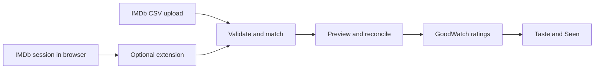

# IMDb ratings import and ongoing sync

Research date: 2026-09-30. Status: exploration and recommendations, not an approved implementation plan. Three parallel research agents investigated IMDb capabilities, existing solutions, and Chrome extension feasibility; the synthesis also examines GoodWatch's current code. Sources are first-party documentation, project source code, and explicitly identified maintainer/staff reports. No authenticated IMDb account, fresh export, extension, or third-party importer was tested.

## Recommendation

Build a repeatable **IMDb CSV import** as the foundation. Make it useful immediately by bringing existing ratings into Taste, with exact title matching, a preview, protection for GoodWatch edits, and undo. Then investigate an optional **browser-assisted sync extension**, preferably starting with assistance for IMDb's export workflow. Keep acquisition separate from matching and reconciliation so both routes share the same importer.

The key limitation is access, not rating conversion: IMDb officially supports personal-rating export, but the reviewed documentation does not expose a consumer OAuth integration, personal-ratings feed, or webhook. Chrome supplies useful automation primitives, not an IMDb integration contract. A reliable always-on connection would need an authorized service integration or a separately operated host, not merely an installed extension. [IMDb ratings FAQ](https://help.imdb.com/article/imdb/track-movies-tv/ratings-faq/G67Y87TFYYP6TWAV), [IMDb API scope](https://data.imdb.com/documentation/api-documentation/), [Chrome alarms](https://developer.chrome.com/docs/extensions/reference/api/alarms)

IMDb's Conditions of Use restrict automated extraction without express written consent. This is a concrete dependency for shipping automated retrieval; neither public ratings nor a Chrome Web Store listing resolves it. Supported user CSV import is a distinct path. Treat a permission/partnership inquiry as a proposed next step, not something performed by this research. [IMDb Conditions of Use](https://www.imdb.com/conditions)

## What IMDb supports

| Capability | Evidence and implication |
| --- | --- |
| Personal ratings | One current 1–10 rating per title; films, shows and episodes can be rated. Re-rating replaces the previous value. Ratings are private by default. [Ratings FAQ](https://help.imdb.com/article/imdb/track-movies-tv/ratings-faq/G67Y87TFYYP6TWAV) |
| CSV export | Your Ratings → Export is the supported route to a spreadsheet or another site. No need to make the list public or give GoodWatch an IMDb password. [Ratings FAQ](https://help.imdb.com/article/imdb/track-movies-tv/ratings-faq/G67Y87TFYYP6TWAV) |
| Export preparation | Existing automation requests an export and polls the exports page before downloading it. Its 20-minute timeout is the tool's choice, not an IMDb SLA. IMDb staff state generated list exports remain available for four weeks. UX must allow preparation and later download. [Implementation](https://raw.githubusercontent.com/RileyXX/IMDB-Trakt-Syncer/main/IMDBTraktSyncer/imdbData.py), [IMDb staff explanation](https://community-imdb.sprinklr.com/conversations/imdbcom/what-does-it-mean-watchlist-expires-in-3-days/68713be47f4d2f434cfbcd60) |
| Public ratings | Users can make ratings public, but public visibility supplies neither an API contract nor proof that a submitted profile belongs to the person importing it. The ownership conclusion is an engineering inference. [Ratings FAQ](https://help.imdb.com/article/imdb/track-movies-tv/ratings-faq/G67Y87TFYYP6TWAV) |
| Commercial API | IMDb documents title/name entertainment datasets, with AWS credentials, subscriptions and API keys. This is not a documented consumer login grant for someone's personal ratings. No consumer OAuth, delta feed or webhook was found; private partnership capabilities remain unknown. [API documentation](https://data.imdb.com/documentation/api-documentation/), [access requirements](https://data.imdb.com/documentation/api-documentation/getting-access/) |
| Account-data request | A separate portability request requires email verification within five days and download within 90 days. The help page gives no import-ready ratings schema or continuous-sync contract. [Account data request](https://help.imdb.com/article/imdb/general-information/how-can-i-request-my-imdb-account-data/GPM94GL779DCMTY5) |

Do not apply IMDb's documented 12,000-item limit for Watchlists, lists and check-ins to ratings: that source does not establish a ratings limit. Exported titles can use original names, and some metadata depends on location, reinforcing the need for identifier matching. [Lists FAQ](https://help.imdb.com/article/imdb/track-movies-tv/lists-faq/GNQMN47VZSE7KW38), [list redesign FAQ](https://help.imdb.com/article/imdb/new-features-updates/list-pages-redesign/GLF7EF3VJPXM34XG)

### File contract to validate

Current open-source parsing reads `Const`, `Your Rating`, `Date Rated`, `Title Type`, `Title`, and `Year`. A historical schema-change report also shows `Original Title`, `URL`, `IMDb Rating`, `Runtime (mins)`, `Genres`, `Num Votes`, `Release Date`, and `Directors`. These are observed fields, not an official immutable schema. [Parser source](https://raw.githubusercontent.com/RileyXX/IMDB-Trakt-Syncer/main/IMDBTraktSyncer/imdbData.py), [schema change report](https://github.com/RileyXX/IMDB-Trakt-Syncer/issues/93)

**Checked against a real export (2026-10-02, two rated movies, private account):**

- Filename is `imdb-<uuid>.csv`, not `ratings.csv`. No BOM, LF line endings.
- Header row, in order: `Const, Your Rating, Date Rated, Title, Original Title, URL, Title Type, IMDb Rating, Runtime (mins), Year, Genres, Num Votes, Release Date, Directors`. This matches the 14 columns the open-source tools expect.
- `Your Rating` is a plain integer (`4`, `10`). `Date Rated` is `YYYY-MM-DD` with no time.
- `Title Type` is the display label `Movie`, capitalised. Normalise case and spacing before mapping types.
- `Title`, `Original Title`, `Genres`, `Release Date` and `Directors` are double-quoted; IDs, numbers, URL and `Date Rated` are not. Genres are separated by comma and space, directors by a bare comma, so a naive split on commas breaks rows.
- `URL` has no trailing slash.

Not covered by this sample: series, episodes and other title types, non-ASCII titles, titles containing quotes, a rerated title, and a large library.

Proposed importer rules:

- Match headers, not positions or a hard-coded filename. Preserve unknown columns only if needed; tolerate optional columns.
- Use `Const` (`tt…`) as identity and `Your Rating` as the person's integer 1–10 score. Never import the aggregate `IMDb Rating` as a personal rating.
- Preserve `Date Rated` separately from ingestion time. It is not a watched date. Rerating/date semantics and locale/encoding behavior need a fresh export check.
- Handle quoted commas/newlines, UTF-8 BOM, invalid scores/IDs, duplicate rows, empty files and unknown title types explicitly. Different ratings for the same ID need a conflict, not arbitrary last-row wins.
- Initially import movie ratings; optionally include series-level ratings after confirming scope. Report episodes and other unsupported types separately. Never turn an episode rating into a rating of its parent show.

## Existing solutions and lessons

| Solution | Verified route | What it demonstrates / limitation |
| --- | --- | --- |
| [Letterboxd](https://letterboxd.com/about/migrating-from-imdb/) | Manual IMDb CSV import with optional ratings | Established migration UX. Its [import guide](https://letterboxd.com/about/importing-data/) offers review/match correction and warns about TV matching to films; no undo after confirmation. |
| [Simkl](https://simkl.com/apps/import/imdb/) | IMDb CSV upload; automatic, plan-to-watch or seen interpretation | Rated movies become watched in automatic mode. This page does not establish ongoing IMDb sync. |
| [Trakt native importer](https://forums.trakt.tv/t/import-from-imdb-letterboxd-tv-time-csv-or-json-files/32483) | IMDb/Letterboxd history and watchlist import; repeat imports and undo documented by staff | Initial announcement deferred personal ratings. Current ratings support was not verified, so file support must not be presented as proof of rating support. |
| [TraktRater](https://github.com/damienhaynes/TraktRater) | Desktop transfer from CSV, alternatively public-profile scraping | Recommends CSV; supports movie/show/episode ratings and optional watched marking. Current successful execution/maintenance not verified. |
| [cecobask/imdb-trakt-sync](https://github.com/cecobask/imdb-trakt-sync) | One-way scheduled browser scraping into Trakt; dry-run, add-only and full mirror modes | Uses IMDb credentials/cookie for ratings. Archived August 2, 2026: useful architecture precedent, not a maintained dependency. |
| [RileyXX/IMDB-Trakt-Syncer](https://github.com/RileyXX/IMDB-Trakt-Syncer) | Python/Chrome automation with Trakt API; bidirectional transfer; OS scheduling | Automates IMDb export and download. README warns about credential storage and captcha failures; not overwriting existing items means bidirectional transfer does not necessarily reconcile reratings. |
| [RatS](https://github.com/StegSchreck/RatS) | Browser-driven cross-service rating transfers | Private lists through authentication; unmatched export and retry patterns. Intermittent maintenance and AGPL-3.0 licensing require separate consideration before code reuse. |

The strongest concrete extension precedent is RileyXX's actual export automation: request export, poll `/exports/`, download, parse named columns. Its missing-file path returns an empty list; GoodWatch must distinguish failure from a genuinely empty collection before making any deletion decision. Existing implementations prove plausibility, not reliable operation today or authorization. [Source code](https://raw.githubusercontent.com/RileyXX/IMDB-Trakt-Syncer/main/IMDBTraktSyncer/imdbData.py)

External hubs introduce dependencies of their own. Trakt's July 30, 2026 change gates new API-app creation behind VIP; this is not evidence that every end user needs VIP. The archived syncer's maintainer links abandonment to Trakt app access. A hub only helps people who already keep it current; it does not solve IMDb → hub acquisition. [Trakt change](https://github.com/trakt/trakt-web/pull/3057), [maintainer report](https://github.com/cecobask/imdb-trakt-sync/issues/107)

No maintained, successfully tested Chrome extension providing continuous personal IMDb-rating sync was established in this research. Aggregate-rating extensions are a different product: for example, [More Ratings on Letterboxd](https://github.com/EKarton/More-Ratings-on-Letterboxd) displays aggregate scores via OMDb, not someone's ratings.

## Options compared

These assessments are recommendations inferred from the evidence above, not measured reliability or cost estimates.

| Route | Ongoing behavior | Main tradeoff | Assessment |
| --- | --- | --- | --- |
| CSV + safe reimport | Person exports/uploads again | A few manual steps; export preparation can interrupt onboarding | Best foundation and fallback |
| Extension-assisted export | Person starts import in an authenticated browser | Removes file-handling friction if the export/download flow can be bridged reliably | Best first extension experiment |
| Extension snapshot sync | Periodic checks while browser/session prerequisites hold | Desktop dependency, auth expiry, site changes, automation permission | Promising optional phase after validation |
| Observe rating changes in IMDb tabs | Fast updates from that browser | Misses mobile, other browsers and time while disabled | Supplement to complete snapshots only |
| Server poll public profile | Runs without user's desktop | Public exposure, ownership ambiguity, scraping/pagination/permission risks | Poor default |
| Server browser with user credentials/cookies | Can run on a schedule | Sensitive session custody, challenges, operational cost and fragile UI | Poor consumer-product tradeoff |
| Trakt/other hub | Depends on upstream IMDb transfer | Extra account and unresolved first leg | Useful separate integration, not IMDb solution |
| Bookmarklet/local script | User-triggered or locally scheduled | Browser restrictions or technical setup; no dependable always-on promise | Power-user experiment, weak primary UX |
| Authorized IMDb partnership | Potentially service-side | Availability, permitted scope and commercial terms unknown | Explore if continuous sync is essential |
| Account data archive | Occasional portability | Unknown rating schema and request latency | Recovery alternative, not sync |

## Chrome extension feasibility

**Technically credible; IMDb retrieval remains unproven.** Content scripts can read the DOM, while host-permitted extension workers can make cross-origin requests. Content-script fetch still follows the page's origin restrictions. Permissions do not bypass authentication, CSRF checks or challenges, and isolated content scripts do not automatically see page JavaScript state. [Content scripts](https://developer.chrome.com/docs/extensions/develop/concepts/content-scripts), [network requests](https://developer.chrome.com/docs/extensions/develop/concepts/network-requests)

Start a click-to-sync experiment with `activeTab` and `scripting`. `activeTab` access is temporary, so automatic updates would require appropriate optional site permissions. Test browser-managed session attachment rather than extracting cookies. Explicit cookie access requires additional permissions and should not be a default requirement. [activeTab](https://developer.chrome.com/docs/extensions/develop/concepts/activeTab), [permissions](https://developer.chrome.com/docs/extensions/develop/concepts/declare-permissions), [storage/cookie behavior](https://developer.chrome.com/docs/extensions/develop/concepts/storage-and-cookies), [cookies API](https://developer.chrome.com/docs/extensions/reference/api/cookies)

Manifest V3 workers stop when idle, and long operations have time limits. Alarms can be delayed, do not wake sleeping devices, and should be checked/recreated for compatibility. Use durable checkpoints and bounded resumable batches; an installed extension cannot work while Chrome is fully stopped. Google's phone flow adds extensions to desktop Chrome, so this is not on-phone Chrome syncing. Mobile IMDb edits require a later complete desktop retrieval. [Worker lifecycle](https://developer.chrome.com/docs/extensions/develop/concepts/service-workers/lifecycle), [alarms](https://developer.chrome.com/docs/extensions/reference/api/alarms), [extension installation](https://support.google.com/chrome/answer/2664769?hl=en)

Compare three acquisition adapters: authenticated DOM extraction, browser-session fetch of the site's own data, and export assistance. Only the browser primitives are documented; endpoints, pagination, session behavior and complete retrieval need validation. Observing clicks is insufficient: import only confirmed persisted changes. An internal IMDb endpoint remains an undocumented dependency even if a prototype works.

Proposed data path:

Pair the extension to GoodWatch with a revocable token scoped to rating import. A GoodWatch consent screen and one-use, state-bound code exchange would need to be built; Chrome's `identity.launchWebAuthFlow` can assist that flow but does not create an OAuth server. Keep IMDb credentials, cookies and CSRF tokens entirely in the browser. Restrict token storage to trusted extension contexts, validate message senders, and never expose an arbitrary fetch proxy to web pages. [Identity API](https://developer.chrome.com/docs/extensions/reference/api/identity), [storage access levels](https://developer.chrome.com/docs/extensions/reference/api/storage), [network security guidance](https://developer.chrome.com/docs/extensions/develop/concepts/network-requests#security-considerations)

Distribution entails minimum permissions, accurate disclosures about ratings sent to GoodWatch, consent, and secure handling. Executable extractor changes generally require extension releases rather than remotely downloaded code. Store approval and IMDb authorization are separate questions. [Web Store policies](https://developer.chrome.com/docs/webstore/program-policies/policies), [remote hosted code](https://developer.chrome.com/docs/extensions/develop/migrate/remote-hosted-code)

## Fit with GoodWatch

Repository facts, checked on the research date:

- Personal ratings are already integer 1–10, keyed by user, TMDB ID and `movie`/`show`. No conversion is needed. The existing generic score writer also replaces `review` with null when no review is supplied: an importer must not blindly call it and erase written reviews. [scores.server.ts](../../goodwatch-webapp/app/server/scores.server.ts)
- Movie/show catalog data already contains IMDb IDs, and existing identity repair prefers TMDB's IMDb identity with a Wikidata fallback. Resolve exact IMDb IDs against the catalog, then apply existing canonical title IDs; do not fuzzy-match titles automatically or arbitrarily select among ambiguous matches. [External IDs](../external-ids.md), [catalog.server.ts](../../goodwatch-webapp/app/server/combined-search/catalog.server.ts), [title-identity.ts](../../goodwatch-webapp/app/utils/title-identity.ts)
- Guest transfer already demonstrates authenticated account binding, reviewed changes, retry journaling, protection against intervening score edits, preserving reviews, and cache invalidation. Reuse the principles; its sequential writes and whole-journal rewrites are not a proven bulk-import engine. [Guest transfer route](../../goodwatch-webapp/app/routes/api.import-guest-interactions.ts)
- Taste rebuilds are coalesced after rating writes and account for Crate visibility delay. Bulk imports should invalidate affected user/Taste caches after committed batches and confirm persistence before reporting completion. [Taste member storage](../../goodwatch-webapp/app/server/taste/member.server.ts), [user data](../../goodwatch-webapp/app/server/userData.server.ts)
- The domain defines rated titles as Seen. Import should not invent a watch date, add Want to See, create share lists, or silently erase independent library flags. A stored rating may not yet contribute to Taste if its title lacks the required fingerprint; report import success separately from recommendation readiness. [Domain vocabulary](../../CONTEXT.md), [Taste member implementation](../../goodwatch-webapp/app/server/taste/member.server.ts)
- Existing settings navigation has Country, Streaming, Profile and Account. An Imports or Connected accounts destination is a proposal, not an existing screen. [Settings route](../../goodwatch-webapp/app/routes/settings.tsx)

No conflict with the two current ADRs was identified: neither specifies personal-rating imports or sync. This note does not establish a new domain decision.

### Reconciliation behavior to agree before implementation

Recommended default: **IMDb → GoodWatch only; protect GoodWatch edits.**

| Situation | Proposed behavior |
| --- | --- |
| New IMDb rating, exact supported match | Add after initial preview/consent |
| Same source rating imported again | No-op; retry/reimport must be idempotent |
| IMDb rating changed, GoodWatch unchanged since last application | Update during explicitly enabled ongoing sync; show in manual import preview |
| GoodWatch changed since last application | Keep GoodWatch by default; show conflict and explicit choice |
| GoodWatch rating locally deleted after import | Preserve the local removal until the user explicitly elects to import it again; needs a tombstone/provenance record |
| Missing from new file or retrieval | Keep GoodWatch; no deletion propagation in initial versions |
| Ambiguous identity, missing catalog entry, unsupported type | Hold/report separately, allow later retry; never substitute a similar title |
| Interrupted upload/export or partial pagination | Mark incomplete; resume/retry; never treat as an empty source |
| Different IMDb or GoodWatch account | Stop and require deliberate source/account selection |
| Undo a batch | Reverse only writes still owned by that batch; preserve subsequent user edits |

Persist an import batch and source observations: source IMDb ID/account when actually known, raw score/date, normalized target ID/type, last applied value/revision, outcome and prior value for undo. A CSV may not identify its owner; a typed label is not ownership verification. Prevent older exports from silently rolling newer source state backward; without a trustworthy snapshot timestamp, present changed values for review. Never use coarse `Date Rated` alone as a reliable global event ordering.

Separate imported source observations from effective GoodWatch ratings. That supports conflict handling, safe repeat imports, local removals and future transport changes. For large libraries, use bounded batches, per-item outcomes and retry tokens; enforce file/row limits and avoid per-row cache rebuilds. These are proposed requirements, not current capabilities.

## Suggested UX

**Entry points:** “Already rate on IMDb? Import your ratings” beside early Taste onboarding, plus a persistent settings entry. Avoid making installation a prerequisite to getting useful recommendations. Durable import should belong to a signed-in GoodWatch account; local file preview could precede sign-in if it can survive the handoff.

**Import flow:**

1. Explain “Bring your IMDb ratings into GoodWatch to build your Taste.” Provide an Open IMDb ratings action, illustrated export instructions, an exports-page link, and a CSV picker. State that IMDb may need time to prepare the file. Let the person return later without losing onboarding progress.
2. Validate and match. Show counts for new ratings, changes, unchanged ratings, conflicts, missing titles, unsupported types and invalid rows. Use expandable detail, not a mandatory review of every matched title.
3. Default to keeping existing GoodWatch ratings where values differ on first import. Offer a clear “Use IMDb ratings for these conflicts” choice. Show movie/show scope explicitly and explain excluded episodes. Do not label one rating as newer when evidence is insufficient.
4. Confirm with a precise action such as “Import 842 ratings” (illustrative count). Show resumable progress and a final receipt with outcomes, retry unresolved items and Undo import.
5. Lead back to Taste and discovery. If some imported titles cannot contribute yet, explain that accurately rather than implying every rating immediately improved suggestions.

**Repeat import:** show the previous import date and “Upload a newer export.” Explain that importing again adds missing ratings and lets the person review changes. A CSV success is “Imported,” not “Connected.”

**Optional extension:** offer after the first useful import. Pair GoodWatch, explain the one-way data flow, obtain narrow site permission, identify the intended IMDb account where possible, then preview the first full snapshot. Only promise the level actually established by the spike:

- Full browser-session retrieval works: “Keep ratings updated while Chrome is running and you're signed in to IMDb.”
- Ratings-page access is required: “Update GoodWatch when you open your IMDb ratings.”
- Only assisted export works: “Import from IMDb with fewer steps.”

Display last successful complete sync separately from last attempt. Useful states include Up to date as of [time], Waiting for Chrome, Sign in to IMDb, Open IMDb ratings, Needs review, Paused, and IMDb changed—use CSV for now. Offer Sync now, Pause, Disconnect and import history. Disconnect stops future updates; removal of previously imported ratings is a separate choice. Do not present a recent failed attempt as fresh data.

## Validation and next decisions

The smallest next evidence step is a fresh official export and a bounded extension spike, not a commitment to continuous sync.

| Experiment | Evidence needed / success criterion |
| --- | --- |
| CSV reality check | Fresh private-account export; exact headers, encoding, title types, rating dates, generation steps; rerate a title and compare exports |
| Matching quality | Representative real library: exact movie matches, missing titles, duplicate catalog IDs, shorts/TV/episodes; report measured coverage without fabricated target accuracy |
| Extension acquisition | Compare export assistance, DOM extraction and browser-session fetch; document required origins, session/tab conditions, complete pagination and result parity with CSV |
| Cross-device changes | A phone rating and a rerating of an old title appear in the next full snapshot; local page observation alone does not count |
| Interrupted operation | Worker termination, browser restart, offline mode, expired session, revoked permission and cookie restrictions do not duplicate writes or infer removals |
| Account/conflict safety | Account switch cannot mix libraries; GoodWatch changes/deletions survive repeat imports; undo preserves later edits; existing reviews survive |
| Operation and distribution | Establish permitted automated access, minimum permissions, feasible release/update process, and acceptable interruption rate before offering automatic sync |

Start with source-add/update behavior; leave source-deletion mirroring and bidirectional writes out of the first implementation proposal. If no complete reliable retrieval works, the extension can still be an assisted importer. If even that adds little convenience, keep CSV and investigate authorized access instead.

Product decisions still open: movie-only versus series-level support, default treatment of first-import conflicts, whether ongoing updates should overwrite untouched imported ratings automatically, and how important browser-independent freshness is. No accounts were connected, credentials requested, third parties contacted, GitHub issues created, or product code changed during this research.
